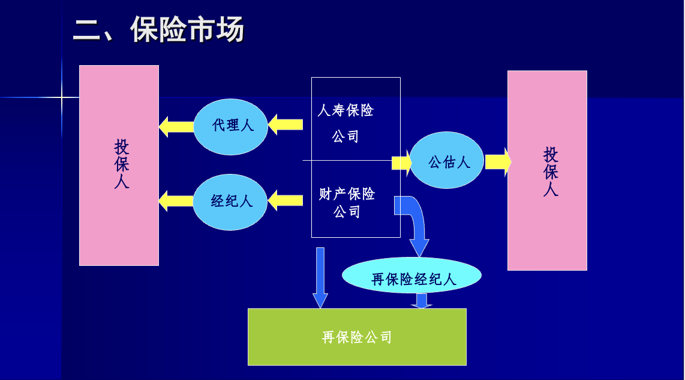
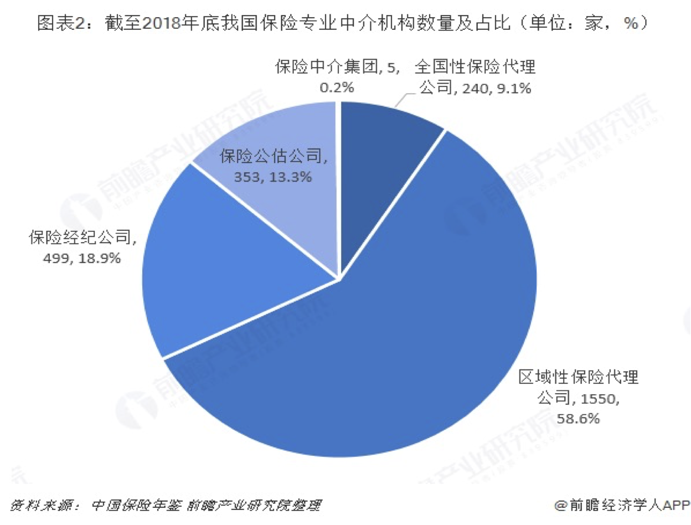

# 保险学

## 第一章 保险学概述

### 一、什么是保险？

* 广义：保险是集合同类危险聚资建立基金，对特定危险的后果提供经济保障的一种危险财务转移机制。

* 狭义:局限于商业保险的范畴

​	保险是指投保人根据合同约定，向保险人支付保险费，保险人对于合同约定的可能发生的事故因其发生所造成的财产损失承担赔偿保险金责任，或者当被保险人死亡、伤残、疾病或者达到合同约定的年龄、期限等条件时承担给付保险金责任的商业保险行为。

​																											——《中华人民共和国保险法》

#### 	1 几个概念的比较

**储蓄，投资，救济，赌博，投机**

* 保险与储蓄

  * 经济关系不同。    

    保险是一种互助行为      

     储蓄则是个人的自助行为，属于风险自留方式。

  * 原则不同

    保险以投保自愿、退保自由为原则。     

    储蓄是以存款自愿、取款自由为原则，个人始终拥有对存款这项财产的所有权和支配权。

  * 支付关系不同

    保险的支付和反支付不具有对等的关系

    保险的存和取是对等的

* 保险与投资

  * 保险属于一种投资形式

    但它并不等同于纯粹的、以盈利为目的的投资。
    保险强调的更多的是保障功能。

    投资联结型保险产品，分红保险，万能寿险，等

* 保险与救济

  * 保险是一种合同行为。

    救济行为是政府部门、社会团体或个人的独立行为。

  * 保险是保险当事人双方的行为，保险合同的签订必须得到双方的一致意见，并且存在对价交易。
  
    救济则是单方面的行为，救济方不受被救济方的任何约束。
  
  * 保险赔偿金通常是按照损失情况予以确定的，因此，保险费的计算有着特殊的计算方法；救济金的给付则是随救济方的意愿而定。 
  
* 保险与赌博 投机

  * 保险所承保的风险是客观存在的。而赌博中的风险是由赌博行为本身所引起的。
  * 保险所承保的是纯粹风险。而赌博具有损失和额外获利的双重可能，属于投机风险。
  * 在保险中，投保人必须对保险对象有可保利益。而赌博无此限制。
  * 保险具有生产性，即保险事故发生后的赔付能够促进生产生活的恢复。而赌博是非生产性的，赢者总是以输者的损失为代价。
  

#### 2 **保险的特征**

* 就分担损失而言，保险具有互助性质；（经济角度）
* 就形式而言，保险是一种合同行为；（法律角度）
* 就保险的目的而言，保险是对灾害事故损失进行的经济补偿；（社会角度

### 二、保险市场

#### 1 保险人

* 公营保险组织
* 私营保险组织
* 合营保险组织：公私合营 / 与外商合营股份有限公司 / 中外合资保险经营机构
* 合作保险组织：消费者合作保险组织/生产者合作保险组织如：相互保险公司、相互保险社、保险合作社/蓝十字会、蓝盾医疗保险组织
* 行业自保组织

#### 2 保险中介

* 保险代理人

​	保险代理人是根据保险人的委托，向保险公司收取佣金，在保险公司授权的范围内代为办理保险业务的机构或者个人。

​	分为：保险专业代理机构；保险兼业代理机构；个人保险代理人

​	其他：如精算师事务所，会计师事务所，事故调查机构，商品检验机构，保险信用评级机构，律师事务所，等

​	分为：保险专业代理机构；保险兼业代理机构；个人保险代理人

​	《保险代理人监管规定》（2021年1月1日实施）

* 保险经纪人

​	保险经纪人是基于投保人的利益，为投保人与保险人订立保险合同提供中介服务，并依法收取佣金的机构。 

​	组织形式：人寿保险经纪人，非寿险经纪人，再保险经纪人

  **挖掘新的保险需求**

​									**2018保险经纪机构业务收入前10名排名情况**

| **排名** |           **机构名称**           |
| -------: | :------------------------------: |
|    **1** |       **泛华保险服务集团**       |
|    **2** |   **大童保险销售服务有限公司**   |
|    **3** |    **永达理保险经纪有限公司**    |
|    **4** |   **明亚保险经纪股份有限公司**   |
|    **5** | **英大长安保险经纪集团有限公司** |
|    **6** |   **江泰保险经纪股份有限公司**   |
|    **7** |   **中怡保险经纪有限责任公司**   |
|    **8** |   **北京联合保险经纪有限公司**   |
|    **9** | **深圳市中安信保险经纪有限公司** |
|   **10** | **达信（北京）保险经纪有限公司** |

**保险经纪公司背景情况**

  * 英大长安保险经纪集团有限公司：国网资产管理有限公司（现国网英大集团）及各地方电力公司等
* 北京联合保险经纪：北京华天利和投资管理有限公司；上海天石投资有限公司；北京点位投资有限公司。
* 江泰保险经纪公司拥有七大法人股东：北京快速工程规划建设管理公司、中国交通建设股份有限公司、首钢总公司、中国化工进出口总公司、中国煤炭进出口集团公司、中国水利电力对外公司、北京国际信托投资有限公司

**全球三大保险经纪公司**

* 威达信集团（ Marsh & McLennan Companies，MMC ）∙ 美国

  MMC子公司Marsh（达信保险经纪有限公司）是全球领先的保险经纪和风险管理专家。达信（北京）保险经纪有限公司是**中国第一家**外商独资的保险经纪公司。

* 怡安保险（集团）公司（Aon）∙ 美国2003年10月，怡安集团与中国中粮集团合资设立中怡保险经纪有限责任公司。
* 韦莱集团（Willis） ：总部设在伦敦，韦莱中国的总部设在上海韦莱保险经纪有限公司成立于2001年8月，是中国首家由外资控股的保险经纪公司。

* **保险公估人**

​	保险公估是指评估机构及其评估专业人员接受委托，对保险标的或者保险事故进行评估、勘验、鉴定、估损理算以及相关的风险评估。

​	保险公估人是专门从事上述业务的评估机构，包括保险公估机构及其分支机构。

**保险公估人的职能**

*  **评估**
* **公证**
*  **中介**

**保险公估人的服务内容**

* **理赔公估**
*  **承保公估**
*  **对货物装卸进行监视和鉴证**
*  **参与防灾防损**
*  **协调**
* **信息咨询**

​													**我国保险中介市场现状**

### 三、保险的历史发展

#### 1 古代保险思想及原始形态

​	我国：货物分船装运，人身救济后备制度      

​			——原始的社会保险思想      

​			——无商业性的保险

​	外国：火灾救济基金，丧葬互助会，行会      

​			——相互合作的保险组织

#### 2 海上保险的起源和发展

* 共同海损起源说“一人为众，众为一人”

*  船舶和货物抵押借款起源说

  * 船舶抵押借款（冒险借贷）

  

  * 无偿借贷

  

* 意大利是近代海上保险的发源地
       1347年世界上最古老的保单——热那亚商人乔治·勒克维伦开立的保单
       1397年具备现代样式的保单——佛罗伦萨保单
* 英国劳合社（Lloyd’s)
        劳合社不是一个保险公司, 而是一个社团，
        更确切地说，它是一个保险市场。

#### 3 其他险种的发展

* 火灾保险
* 人身保险
* 社会保险

​		起源于19世纪80年代的德国。

* 其他保险

​		汽车保险，航空险，工业险，工程险，责任保险，保证保险，伤害保险，犯罪保险 …

### 四、我国保险发展现状

* 以1949年为界分为两个阶段：

  * 旧中国：

    1805年的谏当保安行（Canton Insurance Society）             

    1865年上海华商义和公司保险行

  * 新中国：

    发展——停顿——发展三个阶段 

### 五、保险的职能

#### 1 保险的基本职能

* 分摊损失
* 经济补偿

​	分摊损失是实现经济补偿的一种手段，经济补偿是分摊损失的目的

#### 2 保险的派生职能

* 融资和投资
* 防灾防损

### 六、保险的基本原理

* **大数法则（Law of Large Numbers）**
  又称“大数定律”或“平均法则”，是概率论主要法则之一。是指一随机事件重复发生的次数越多，对其发生概率作出的预测就越接近真实的情形。

  大数法则是近代保险业赖以建立的数理基础。根据大数法则，承保的风险单位愈多，实际损失的结果会愈接近从无限风险单位数量得出的预期损失可能的结果，也就是损失概率的偏差愈小。因此，保险人运用大数法则就可以比较精确地预测危险，合理地厘定保险费率。 

* **生命表（mortality table）**

  在封闭人口条件下，一批人从出生后陆续死亡的全部过程中，每个年龄人群的生存和死亡概率的统计表。

  * 国民生命表
  * 经验生命表

* **衡量一国保险业水平的指标**

1. 保费收入总额及其占世界保费收入总额的比例。

2. 寿险保费收入

3. 非寿险保费收入

4. 保险深度(Insurance Penetration)：

   是一个国家（地区）的保险费收入占该国家（地区）国内生产总值的比例。

5. 保险密度(Insurance Density)：

   是指一个国家（地区）人均付出的保险费。 

教材:chap2,chap15

## 第二章 风险管理概述

###  一、风险概念及其特征

#### 1 风险的定义

* 风险是损失的不确定性
* 风险是在特定条件下实际后果与预期后果之间的差异
* 风险指引起灾害和意外事故的原因，或指由灾害和意外事故造成的伤害和损失，还可以指灾害和意外事故本身。
* 风险是围绕基于某种预期的不同变化结果的变化结果。对特定情况下关于未来结果的客观疑虑  

1. Risk: 损失的大小和发生的可能性
2. Peril：指损失的原因， 事故本身
3. Hazard: 引起或增加风险事故发生的因素，增加风险事故发生可能性的因素，以及在事故发生后造成损失扩大和加重的因素 

#### 2 风险的三要素

* 风险因素(risk factors, hazards)

  指引起风险事故发生的因素，增加风险事故发生可能性的因素，以及在事故发生后造成损失扩大和加重的因素，包括自然风险因素、道德与心理风险因素、社会风险因素。

  * 自然风险因素是指有形的并能直接影响事物物理功能的因素，即由自然力量或物质条件所构成的风险因素 。
  * 道德和心理风险因素，是指由于道德品行及心理素质等潜在的主观条件产生的风险因素。 
  * 社会风险因素是指社会文化及经济状况产生的风险因素 

* 风险事故（peril）

  损失的直接原因，是促使风险有可能变成现实的事件。包括自然风险事故、人为风险事故、经济风险事故。 
  
* 风险损失载体（exposure to loss）

  风险损失是指人身伤害和伤亡以及经济价值的非故意的、非计划、非预期的减少或消失，有时也指精神方面的危害。 

  损失载体是指面临着可能损失的物体或状态，包括人身损失载体、财产损失载体、责任损失载体等

**实例**

#### 3.风险的特征

* 客观性：不以人的意志为转移，独立于人的主观意识之外
* 不确定性（偶然性）：损失是否发生，空间、时间、损失程度及其承担主体的不确定
* 普遍性：无处不在，无时不有
* 可度量性：风险是在特定的时间和空间条件下的概念，凡是风险都与某种条件相联系。 
* 相对性：不同的人对同样的客观风险会做出不同的判断和行动 
* 发展性: 不同的发展时期面临的风险不同

**风险的基本属性**

​	自然属性

​	社会经济属性

###  二、风险的分类

#### 1 客观风险和主观风险

风险是一个客观概念。

* 客观风险

  实际损失与预期损失之间的相对差异

* 主观风险

  精神和心理状态引起的不确定性，体现在不同的风险态度上。        

#### 2 纯风险和投机风险

Mowbray, Blanchard 和Williams 1969年提出

* 纯风险（pure risk）

  只会造成损失而不会带来收益的风险 ，如撞车的风险

* 投机风险（speculative risk）

  既可能造成损失也可能创造额外收益的风险 

**上述两种风险可能同时存在于一个总风险中。**

#### 3.可保风险

按风险损害的对象分为财产风险、人身风险、责任风险和信用风险

* 财产风险指导致财产发生毁损、灭失和贬值的风险。
* 人身风险指因生、老、病、死、残而导致的风险。

​										**人身风险的风险等级分类表**

​									**我国女性和男性死亡的主要原因**

* 责任风险指依法对他人造成过失人身伤害或财产损失应负的法律赔偿责任或无法履行契约所致对方受损应负的合同赔偿责任。

**可保风险的条件**

* 经济上的可行性：发生的频率低但损失程度大
* 大量同质的风险存在
* 损失必须是意外的和偶然的
* 损失必须是确定的或可以测定的
* 特大灾难一般不会发生（非巨灾性）
* 保险费必须合理，被保险人经济上能够承担

#### 4 风险的其他分类

* 根据产生的原因划分

  （1）自然风险(Physical Risk)
  （2）社会风险(Social Risk)
  （3）政治风险(Political Risk)
  （4）法律风险(Legal Risk) 
  （5）操作风险(Operational Risk)
  （6）经济风险(Economic Risk)
  （7）认知风险(Cognitive Risk)

* 非系统风险和系统风险（non-system risk; system risk)
  投资组合的多样化可以减小单一投资的风险，但组合后的风险并非为零。被减小的风险称为可分散风险（非系统风险），剩余的风险是整个市场的风险，称为不可分散风险（系统风险）。

###  三、风险管理过程

#### 1 风险管理的定义

​	风险管理是指经济单位通过风险识别、风险估测、风险评价，对风险实施有效的控制和妥善处理风险所致损失，期望达到以最小的成本获得最大安全保障的管理活动。

#### 2 风险管理的基本程序

* **设定目标** 

  与组织或个人的整体目标相一致。

  风险与收益之间的平衡。

  考虑对安全性的态度和接受风险的意愿。 

  成本收益分析

  风险成本：由于风险的存在和风险事故发生后，人们所必须支出的费用和预期经济利益的减少。包括风险损失的实际成本、风险损失的机会成本以及预防或控制风险损失的成本。 

​		损前目标

​		经济合理目标 ，安全系数目标，社会责任目标

​		损后目标

​		维持生存目标，持续经营目标，稳定收益目标，社会责任目标

* **风险识别(Risk Identification)** 

  对潜在的和客观存在的各种风险进行系统地、连续地识别和归类，并分析产生风险事故的原因的过程。主要包括感知风险和分析风险两方面

  风险源列表

  * 物质环境
  * 社会环境
  * 政治环境
  * 法律环境

  暴露识别

  * 实物资产暴露

  * 金融资产暴露

  * 法律责任风险暴露

  * 人力资本风险暴露

    ​				**因果分析法（cause-effect Analysis, 鱼骨图）**

  

* **风险衡量(Risk Measurement)**

  运用概率及数理统计方法，衡量潜在损失的规模和损失发生的可能性，即掌握风险的两个方面——损失的大小和损失发生的可能性，以便于评价各种潜在损失的相对重要性。

  **方法**:

  - 定性:集合意见法、德尔菲法、层次分析法和事故树分析法、主要风险障碍分析法、领先—落后指标分析法等 

  - 定量:风险指数法、概率方法（如主观概率法、随机方法、蒙特卡罗法等）、模糊论方法（如模糊概率法、模糊参数回归分析法、模糊矩阵分析法等）、移动平均法、指数平滑法、因果关系预测法、方差协方差矩阵法、历史模拟法等

  - 定性和定量的结合：事故树分析法和事件树分析法

    ​										**事故树分析法（FTA）**

    

* **风险评价(Risk Assessment)**

  在风险识别和风险衡量的基础上，把风险发生的概率、损失严重程度结合其他因素综合起来考虑，得出系统发生风险的可能性，评价其危害程度，并与公认的安全指标比较，确定危险等级。 

  **步骤**：

  确定安全指标，确定评价时的风险水平，对应比较

  **安全指标**就是经济单位针对不同的风险确定的可以接受的风险损失。

  **正常损失期望**是经济单位在正常的风险防范措施下，遭受损失的期望值；

  **可能的最大损失(PML)**是指经济单位在某些风险防范措施出现故障情况下，可能遭受的最大损失；

  **最大可能损失(MPL)**是指经济单位在最不利的条件下，估计可能遭受的最大损失额。

  风险水平：单个风险水平和整体风险水平。

  **方法：**

  主观评分法

  概率树法

  决策树法

  

  

  层次分析法

  模糊风险综合评价

  故障树分析法

  外推法 

  风险评审技术（VERT)  

* **风险管理技术的选择与实施**

  风险管理方案：通常是由多种风险管理技术组合而成的，这些技术方法往往需要多个部门相互配合才能得以顺利实施。
  专人负责：例如风险经理
  应急方案  

* **风险管理效果评价**

  风险管理效果评价是分析、比较已实施的风险管理方法的结果与预期目标的契合程度，以此来评判风险管理方案的科学性、适应性和收益性。

  四个方面：

  （1）风险管理方案实施的效果；

  （2）风险管理决策的科学性；

  （3）风险管理者的管理水平；

  （4）风险管理的执行情况，总结风险管理实施过程中的经验和教训。  

###  四、风险管理技术

#### 1 控制型风险管理

​	是指经济单位有意识地采取措施，以消除风险，或防止及减少灾害事故的发生及其造成的经济和社会损失。

* 事前：实施各种控制工具，力求消除各种隐患，减少风险发生的原因，主要以预防为主，侧重于控制损失发生的概率。 

* 事后:运用控制工具将损失减少到最低限度，主要以减损为主，侧重于控制风险损失的大小

* **工具：**

  * 风险避免：通过放弃某项活动以达到回避因从事该项活动可能产生的潜在损失的行为，包括主动避免和被动放弃。
  * 防损：在风险发生前，为了消除和减少可能引起损失的各种因素而采取的处理风险的具体措施。

  | **风险要素** |         **防损措施**         |
  | :----------: | :--------------------------: |
  |     烟尘     |  禁止吸烟，没收有烟尘的材料  |
  |     水灾     |   筑建大坝，水库，水源管理   |
  |  人行道结冰  |     铲雪、撒盐、加热路面     |
  |     污染     | 制定使用协议，污染物处理措施 |
  |   酒后驾车   |    禁止，处罚、拘留、判刑    |

  |         **环境**         |                 **防损措施**                 |
  | :----------------------: | :------------------------------------------: |
  | 饭店地板由于油污变得很滑 | 铺防滑垫，设置提醒滑倒的标记，使用油污吸收剂 |
  |        非熟练工人        |                     培训                     |
  |  没有灯光的市中心停车场  |         设置路灯，导引人员，安全服务         |
  |  治安混乱的城乡结合地区  |     避免夜间单独外出，配备警力，防盗装置     |
  |         高速公路         |            设置护栏，指示灯，路标            |

  |  **风险因素与环境的相互作用**  |              **防损措施**              |
  | :----------------------------: | :------------------------------------: |
  | 加热过程可能使周围设备过度受热 |             安装水冷却系统             |
  |    雇员搬运货物箱动作不合理    |                 护腰带                 |
  |    电工在寒冷的室外修理电线    | 保暖服装，寒冷气候下的工作手册，绝缘鞋 |
  |   道路光滑时车辆容易发生事故   |       ABS刹车（防锁死刹车系统）        |

  * 减损：风险事故发生时或发生后采取的各种防止损失扩大的措施。如抢救，风险分离或隔离、风险分散、追偿、建立应急计划等 。
    * 抢救：在最短时间内作出阻止损失扩大的正确反应 
    * 风险分离或隔离：就是将风险载体之间相互隔开或分离。 
    * 风险分散：是根据风险因素间以及风险因素与其他因素间的负相关关系，将风险载体多样化组合，使各载体承受的风险相互抵消以减少风险 。
    * 追偿：是指在损失发生后，如果损失是由其他责任人造成的，受损害方有权向其提出索赔，通过赔款从经济上弥补一部分损失 。
    * 应急计划：通常是多种风险管理措施的组合运用，比如应急培训、建立应急领导小组、应急融资计划、改进建筑结构、备份重要记录并存放在不同的地方、建立与社区的合作关系，等 
  * 控制型风险转移：通过财产及活动的转移，或者通过签订协议和交易标准化，使一部分或全部风险转移到受让方。
  * 信息管理：通过良好的信息沟通和知识传递，能够降低人们对于周围环境及活动的不确定性，从而能够更好地防范风险。

#### 2 财务型风险管理

​	对无法控制的风险，在事前做好吸纳风险成本的财务安排。

（1）自留风险：也称为风险自担，是经济单位自己承担全部或部分风险的一种风险管理方法，分为主动自留和被动自留。如损失储备基金、自保公司。

（2）财务型风险转移：有意识地将风险损失有关的财务后果转嫁给另一单位或个人承担的一种风险管理方式。包括保险和其他非保险财务型风险转移（如租赁和担保）。 

保险是一种风险转移的方法，即将少数人的损失分摊给同类险种的所有投保人。

**自保公司**

​	自保公司是为母公司承保的一个子公司。

* 减少和消除许多向外部保险公司购买保险所需的费用;
* 在保费收取、赔款支付以及承保范围方面有很大变通性；
* 母公司可以享受到保险投资收益的好处；
* 有些国家，自保公司可以享受税收优惠和减免；
* 设立在避税地或低税率国家的自保公司，可以享受税收方面的好处；
* 自保公司积极的风险控制，使母公司在传统保险市场上更有优势，自保公司本身也在再保险市场上可以得到较优厚的再保险条件。
*  风险分散能力有限；
* 承保中积累的经验和技术相对较弱

**风险管理技术的选择**

| **损失频率** | **损失程度** | **风险管理技术** |
| ------------ | ------------ | ---------------- |
| **低**       | **小**       | **自留**         |
| **高**       | **小**       | **防损，减损**   |
| **高**       | **大**       | **避免**         |
| **低**       | **大**       | **转移（保险）** |

## 第三章 保险的基本原则

### 一、最大诚信原则

​	民事活动应当遵循自愿、公平、等价有偿、诚实信用的原则。

​                  																					——《中华人民共和国民法通则》

​	保险双方在签订和履行保险合同时，必须以最大的诚意，履行自己应尽的义务，互不欺骗和隐瞒，恪守合同的认定与承诺，否则导致保险合同无效。

**告知，保证，禁止隐瞒和欺诈，弃权和禁止反言**

**告知：**投保人在订立保险合同时或订立合同之前，保险合同当事人应当把与订立合同有关的重要事实向对方陈述或说明。(保险法第16条）

1. 订立保险合同，保险人就保险标的或者被保险人的有关情况提出询问的，投保人应当如实告知。

2. 投保人故意或者因重大过失未履行前款规定的如实告知义务，足以影响保险人决定是否同意承保或者提高保险费率的，保险人有权解除合同.
3. 前款规定的合同解除权，自保险人知道有解除事由之日起，超过三十日不行使而消灭。自合同成立之日起超过二年的，保险人不得解除合同；发生保险事故的，保险人应当承担赔偿或者给付保险金的责任。
4. 投保人故意不履行如实告知义务的，保险人对于合同解除前发生的保险事故，不承担赔偿或者给付保险金的责任，并不退还保险费。
5. 投保人因重大过失未履行如实告知义务，对保险事故的发生有严重影响的，保险人对于合同解除前发生的保险事故，不承担赔偿或给付保险金的责任，但应当退还保险费。
6. 保险人在合同订立时已经知道投保人未如实告知的情况的，保险人不得解除合同；发生保险事故的，保险人应当承担赔偿或者给付保险金的责任。
   * 告知是对合同当事人（保险人和投保人）双方要求的义务；
   *  告知义务要求保险人主动向投保人说明保险合同的内容；
   *  投保人的正确态度是“有问必答”；行为主体是投保人；
   *  投保人向保险公司业务人员或代理人如实告知，就是履行了告知义务；向保险经纪人告知不等于向保险人告知；
   *  区分保险法对“投保人故意不履行如实告知义务”和“过失未履行如实告知义务”的处理规定

**保证：**被保险人承诺不因他的某个作为或不作为使保险标的的危险程度增加。

* 明示保证
  * 承诺保证：现在如此，将来也必须如此
  * 确认保证：现在如此，将来不一定如此
* 默示保证

1. 保证的行为主体是投保人和被保险人；
2. 明示保证和默示保证具有同等法律约束效力

**禁止隐瞒和欺诈：**  

* 隐瞒：指保险合同当事人故意不说明已知的事实，或者只对一部分事实加以说明，足以影响对方正确判断事实的行为。  
* 欺诈：指保险合同当事人故意捏造虚假情况，或者歪曲事实真相，使对方陷入错误，并基于这种错误而予以意思表达的行为 。（保险法第21，116，131）

 **弃权和禁止反言：** 

* 弃权：指保险合同一方当事人放弃他在合同中可以主张的某种权利。 
* 禁止反言：一方当事人一旦放弃了原可主张的权利，以后不得再向另一方主张这种权利。

 一般针对保险人的权利而言

**禁止隐瞒和欺诈**:

* 对投保方和保险人都具有约束力
* 不仅应用于投保过程中，也应用在索赔过程中

###  二、保险利益原则

​	在签订和履行保险合同的过程中，投保人和被保险人对保险标的必须具有保险利益，否则保险合同无效。

* **保险利益构成的条件**
  * 保险利益必须是合法利益
  * 保险利益必须是确定的利益
  * 保险利益是一种具有经济价值的利益
  * 保险利益是一种公益利益
* **保险利益存在时间**
  * 财产险：保险利益必须在损失发生时存在
  * 人寿保险：保险利益只要在保单出立时满足
*  **各类保险中的保险利益**
  * 财产险：财产所有人，抵押权人、质押权人、财产保管人以 及合法预期的保险利益
  * 责任险：法律上的赔偿责任
  *  信用、保证保险：信用行为
  * 人身险：本人、配偶、子女、父母及与投保人有抚养、赡养或扶养关系的家庭其他成员、 近亲属；与投保人有劳动关系的劳动者；除前款规定外，被保险人同意投保人为其订立合同的，视为投保人对被保险人具有保险利益。

###  三、近因原则

​	是保险理赔过程中认定保险责任的基本原则。在处理赔案时，赔偿与给付保险金的条件是造成保险标的损失的近因必须属于保险责任范围，只有当保险事故的发生与损失的形成有直接因果关系时，才构成保险人赔付的条件。

​	**近因**：是指保险事故发生最直接而有效的原因，是起决定作用的原因。

​	近因的不同情况： 单一原因    一连串原因    多种原因

###  四、补偿原则

​	当保险标的在发生保险责任范围内的损失时，通过保险赔偿，使被保险人恢复到受灾前的经济原状，但不能因损失而获得额外收益。

​	即：按照保险合同约定的条件，依保险标的的实际损失，在保险金额以内进行赔偿，且不超过保险利益。

例外情况:定值保险 重置成本保险 人寿保险

###  五、保险代位原则

​	保险事故发生后，保险人按照合同约定向被保险人赔偿了保险金后，按照法律规定取得被保险人有关保险标的的所有权，或者有权向造成保险事故的责任人追偿。

​	两种权利：

 * 代位求偿权

   保险标的发生保险事故所致损失，依法应由第三者承担经济赔偿责任的，保险人自向被保险人支付保险赔偿金之日起相应取得对第三者请求赔偿的权利

   目的：防止被保险人获取重复赔偿；使肇事者对损失负有赔偿责任

   **代为求偿权**

   * 代位求偿权确立的时间
   * 保险人无权代位就间接责任向第三者的索赔。
   * 被保险人先获得第三者责任人的部分赔偿，则保险人的赔偿应扣除相应的部分；保险人向第三者追偿得到的数额大于保险人向被保险人已经支付的保险金，则超过部分退还被保险人。
   * 被保险人不能损害保险人的代位求偿权，如果被保险人放弃对过失方起诉的权利，他也就自动放弃了从保险人处获得损失赔偿的权利。
   * 保险人能放弃代位求偿权。

   **代位求偿的情况**

   * 第三者对被保险人的侵权行为，导致保险标的受损，依法应承担损害赔偿责任；（如：交通事故第三者违章，产品质量不合格）
   * 第三者不履行合同规定的义务，造成保险标的损失，根据合同约定，第三者应对保险标的的损失承担赔偿责任；（如：运输货物损毁，承运人应对被保险人承担损害赔偿责任）
   * 第三者不当得利行为；（第三者盗窃行为）
   * 其他依法规定，第三者应承担的赔偿责任；（如共同海损的受益人对共同海损负有分摊损失的责任）

   **代位求偿的限制**

   ​		《保险法》第62条：除被保险人的家庭成员或者其组成人员故意造成本法第60条第一款		规定的保险事故外，保险人不得对被保险人的家庭成员或者其组成人员代位请求赔偿		的权利。

   ​		理解：自然人和组织

 * 物上代位权

   保险人在保险标的发生保险事故并向被保险人赔偿全部损失后，取得对保险标的的全部权利。 （推定全损）

###  六、分摊原则

是由补偿原则派生出来的，与财产保险中发生的重复保险有关。

在重复保险情况下，当发生保险事故，对于保险标的所受损失，由各保险人分摊；如果保险金额总和超过保险价值的，各保险人承担的赔偿金额总和不得超过保险价值。

重复保险赔偿的分摊方式:

* 比例分摊方式：以保险金额为基础
  $$
  各保险人承保比例=\frac{保险人各自承保的保险金额}{各保险人承保的保险金额总额}
  $$

*  限额责任分摊方式：以赔偿限额为基础，按各保险人在没有重复保险的情况下，单独应该承  担的保险赔偿责任与各保险人单独承担的赔偿责任总和的比例进行分摊。

$$
各保险人赔偿限额比例=\frac{保险人各自单独赔偿的限额}{各保险人各自单独赔偿的限额总额}
$$

*  顺序分摊方式：主保险制，按承保的时间顺序

## 第四章 保险合同

###  一、保险合同概述

1. 定义:保险合同是投保人与保险人约定保险权利义务关系的协议。 
2. 保险合同的种类:
   * 按保险标的
     * 财产保险合同：以财产及其有关利益为保险标的的保险合同。
     * 人身保险合同：以人的寿命和身体为保险标的的保险合同。
   * 按保险金额的确定方式
     * 定额保险
     * 损失补偿保险
   * 按保险金额与保险价值的关系
     * 足额保险合同
     * 不足额保险合同
     * 超额保险合同
   * 按保险标的价值是否事先在保险合同中约定
     * 定值保险
     * 不定值保险

3. 保险合同的特征
   1. 附和性合同
   2. 射幸性合同
   3. 最大诚信合同
   4. 双务合同 

###  二、保险合同的主体和客体  

#### 1 保险合同的当事人

* 保险人：保险人是指与投保人订立保险合同，并承担赔偿或者给付保险金责任的保险公司。
* 投保人：是指与保险人订立保险合同，并按照保险合同负有支付保险费义务的人。
* 被保险人：是指其财产或者人身受保险合同保障，享有保险金请求权的人，投保人可以为被保险人

#### 2 保险合同的关系人

* 受益人：是指人身保险合同中由被保险人或者投保人指定的享有保险金请求权的人，投保人、被保险人可以为受益人。 
* 被保险人

#### 3 保险合同的辅助人

* 保险代理人：是根据保险人的委托，向保险人收取代理手续费，并在保险人授权的范围内代为办理保险业务的单位或者个人。
* 保险经纪人：是基于投保人的利益，为投保人与保险人订立保险合同提供中介服务，并依法收取佣金的单位。
* 保险公估人：是指接受保险合同当事人的委托，为其办理保险标的的勘查、鉴定、估损及赔款的理算等，并出具证明的人。

#### 4 保险合同的客体

​	保险合同的保险利益，即投保人或被保险人对保险标的所具有的可保利益。

###  三、保险合同的签订和生效

#### 1 保险合同的订立

​	保险合同的订立，是保险人和投保人就保险合同主要条款协商一致，签订合同的过程。
​	主要有两个步骤：

* 要保：又称投保，是指投保人填具投保单，提出投保申请的行为。
* 承保：是指保险人对投保人填具的投保单进行签章接受投保人申请投保的行为。

#### 2 保险合同的生效条件

​	《保险法》第13条规定：“依法成立的保险合同，自成立时生效。投保人和保险人可以对合同的效力约定附条件或者附期限。”

​	合同成立的要件： 当事人，标的，意思表示合致

	* 保险合同当事人必须合法
	* 保险合同必须是双方当事人的合意
	* 保险合同的内容必须合法
	* 保险合同形式必须合法 

​										 **保险合同成立和保险合同生效的区别**

保险合同的生效时间也可以因法定或约定而有所变化，一般有以下几种情况：

* 法律法规规定保险合同必须要办理批准、登记手续后才能生效;
* 保险合同附停止条件的，只有在该条件成就之后，保险合同才能生效；
* 当事人约定保险合同附始期，比如有些保险合同条款明确约定了保险责任的起止日期。附始期的效力与附停止条件的效力完全相同；
* 如果投保人不支付保险费，保险人可以依照《合同法》第66条或第67条的规定，主张同时履行抗辩权或顺序履行抗辩权，中止履行，待投保人交付保险费后再行履行自己的义务。

保费缴纳：宽限期，合同效力中止，复效（保险法第36条，第37条）

保险法第44条：以被保险人死亡为给付保险金条件的合同，自合同成立或者合同效力恢复之日起二年内，被保险人自杀的，保险人不承担给付保险金的责任，但被保险人自杀时为无民事行为能力人的除外。

第36条 合同约定分期支付保险费，投保人支付首期保险费后，除合同另有约定外，投保人自保险人催告之日起超过三十日未支付当期保险费，或者超过约定的期限六十日未支付当期保险费的，合同效力中止，或者由保险人按照合同约定的条件减少保险金额。 
被保险人在前款规定期限内发生保险事故的，保险人应当按照合同约定给付保险金，但可以扣减欠交的保险费。 

第37条 合同效力依照本法第三十六条规定中止的，经保险人与投保人协商并达成协议，在投保人补交保险费后，合同效力恢复。但是，自合同效力中止之日起满二年双方未达成协议的，保险人有权解除合同。 
保险人依照前款规定解除合同的，应当按照合同约定退还保险单的现金价值。 

#### 3 表见代理

​	表见代理是指无权代理人的代理行为，因善意相对人有正当理由相信行为人有代理权，对本人即名义上或实际上的被代理人仍然产生代理效力的一种代理制度。

**《保险法》**

第117条  保险代理人是根据保险人的委托，向保险人收取代理手续费，并在保险人授权的范围内代为办理保险业务的单位或者个人。

第127条  保险代理人根据保险人的授权代为办理保险业务的行为，由保险人承担责任。
保险代理人没有代理权、超越代理权或者代理权终止后以保险人名义订立合同，使投保人有理由相信其有代理权的，该代理行为有效。保险人可以依法追究越权的保险代理人的责任。

**《合同法》**

第49条   行为人没有代理权、超越代理权或者代理权终止后以被代理人名义订立合同，相对人有理由相信行为人有代理权的，该代理行为有效。

**构成表见代理的条件**

* 保险代理人无代理权。包括保险代理人自始就没有代理权的无权代理、保险代理人超越代理权的无权代理、保险代理人代理权终止后进行的无权代理。
* 须该保险代理人有被授予代理权之外表或假象，亦即存在所谓“外表授权”。
* 须投保人有正当理由信赖该无权代理人有代理权。
* 投保人基于此信赖而与该保险代理人成立法律行为。

###  四、保险合同的变更、终止和争议处理

1. 保险合同的变更
   * 主体变更，客体变更：当事人和关系人的变更
   *  内容变更
2. 保险合同的解除
   * 法定解除
   * 协议解除

3. 保险合同的终止:合同确定的权利义务消灭。
   *  自然终止
   * 合同已履行而终止
   * 协议注销
   * 违约失效
   * 合同自始失效

4. 保险合同的争议处理
   * 保险合同的解释原则
   *  保险合同的争议处理：协商解决，调解，仲裁，诉讼 

​								**我国保险合同的解释原则**

第125条：当事人对合同条款的理解有争议的，应当按照合同所使用的词句、合同的有关条款、合同的目的、交易习惯以及诚实信用原则，确定该条款的真实意思。合同文本采用两种以上文字订立并约定具有同等效力的，对各文本使用的词句推定具有相同含义。各文本使用的词句不一致的，应当根据合同的目的予以解释。
——《合同法》

第三十条  采用保险人提供的格式条款订立的保险合同，保险人与投保人、被保险人或者受益人对合同条款有争议的，应当按照通常理解予以解释。对合同条款有两种以上解释的，人民法院或者仲裁机构应当作出有利于被保险人和受益人的解释。
——《保险法》

* 文义解释原则：按保险条款文字的通常含义解释；
* 合乎逻辑的解释原则：当保险条款前后用语不一或用词含糊不清而引起歧义时，应根据条款上下文，进行逻辑性的分析和推理，从而探明当事人订立保险合同的真实意图，不能拘泥于条款中的某些词句。在听取当事人的陈述后，还必须根据签约背景、有关具体情况进行合乎逻辑的分析，作出合乎事实的判断。
* 专业解释原则：对保险条款中的专门术语，对其应以所属行业通常理解的专业含义来解释。
* 诚实信用解释原则：保险合同当事人实事求是，讲诚实、守信用，以善意的方式全面履行合同义务，不得规避法律和合同。
* 有利于被保险人的解释原则：也称为疑义解释原则。注意对该原则的滥用倾向。
  * 该原则的适用不具有唯一性和排他性；
  * 该原则的hi适用不具有优先性：合同解释的一般原则及保险合同的其他解释原则的适用是前提和基础；
  * 只有在对保险合同条款有争议而引起的纠纷，才能适用疑义解释原则。保险合同解释只发生在有争议的文字应该如何按其订约时所包含的本意去加以说明与释义的情形，而不是按照合同的条款去对照考察当事人是否违反合同义务。
  * 下列情形，可以排除适用疑义解释原则（1）合同当事人的真实意图可以通过其他突进加以证实的；（2）保险合同条款的歧义经当事人的解释已被排除的；（3）保险合同用语经司法解释已经明确而不再产生歧义的；
  * 适当考虑被保险人类型的差异。
  * 疑义解释原则应当仅适用于格式保险条款。

​												**我国保险合同的解释原则——其他**

1.投保单与保险单或者其他保险凭证不一致的，以投保单为准。但不一致的情形系经保险人说明并经投保人同意的，以投保人签收的保险单或者其他保险凭证载明的内容为准；

2.非格式条款与格式条款不一致的，以非格式条款为准；

3.保险凭证记载的时间不同的**，**以形成时间在后的为准**；**

4.保险凭证存在手写和打印两种方式的，以双方签字、盖章的手写部分的内容为准**；**

5.批注优于正文、后加的批注优于先加的批注

###  五、保险合同条款 

#### 1 保险合同的基本组成

* 声明事项 对被保险的财产或生命情况提供陈述，用来识别被保险的财产或声明，并作为承保和费率制定的依据。
* 保险协议 制定保险责任范围，一切险保险责任范围
* 除外责任 除外的损失原因，除外的损失，除外的财产
* 条件责任 合同双方的权利和责任
* 各种其他条款

保险法规定：

第十九条　保险合同应当包括下列事项： 　

* 保险人名称和住所； 
* 投保人、被保险人名称和住所，以及人身保险的受益人的名称和住所；
* 保险标的；
* 保险责任和责任免除；
* 保险期间和保险责任开始时间；
* 保险价值；
* 保险金额；
* 保险费以及支付办法；
* 保险金赔偿或者给付办法；
* 违约责任和争议处理；
* 订立合同的年、月、日。 

#### 2 保险合同的主要条款

* 基本条款

  当事人的姓名和住所；保险标的；保险金额；保险费；保险期限；保险责任；除外责任；权利义务；赔偿处理

* 特约条款 
  * 保证条款
  * 附加条款：一般附加条款，特约附加条款
  * 协会条款
  * 任选条款

#### 3 保险合同的形式

* 投保单
* 保险单
* 保险凭证
* 暂保单

第一条 保险财产凡是座落、存放在本保险单所载明的地点，属于被保险人（即参加保险的城乡居民，下同）所有或被保险人与他人共有、或应与保险人（即本保险公司，下同）特别约定，并在保险单上注明的属于被保险人代他人保管的家庭财产， 均可向保险人投保： 　　 

​				一、 房屋及附属设备： 　　 

​				二、 室内财产：指衣服、家具、床上用品、厨具、家用电器及文体娱乐用品等。 

第三条 保险责任 　　

​		一、 基本保险：由于下列原因造成的财产损失，保险人负赔偿责任： 　　

​				1、 火灾、爆炸、雷击、洪水、地面突然下陷、崖崩、龙卷风、突发性滑坡： 　　

​				2、 暴风（8级以上风力），暴雨（12小时降水量30毫米或24小时降水量50毫米以上）使房屋的主要结构（指外墙、屋顶、屋架）倒塌和损毁； 　　

​				3、 空中运行物的坠落以及外来固定物的倒塌。 　　

​		二、 综合险：除包括上列基本险的各项责任外，本保险还负责赔偿存放在保险地址室内每件价值30元以上的保险财产，因遭受外来的、有明显痕迹的盗窃、抢劫而造成的破坏和损失。　　

​		三、 为了防止上述灾害蔓延，采取合理的、必要的措施而造成保险财产的损失及支付的合理费用，保险人负责赔偿。 

第二条 不保财产。下列财产不在保险范围以内： 　　

​		 一、 金银、首饰、珠宝、手表、怀表、录音录像、镭射磁带、BB机，手提电话、货币、有价证				券、邮票、古玩、古书、字画、文件、帐册、技术资料、图表、家畜家禽、花、树、鱼、				鸟、盆景以及烟、酒、食品、药物和其它无法鉴定价值的财产； 　　

​		 二、 汽车、摩托车、三轮车、自行车等交通工具；　　 

​		 三、 违章建筑、非法占用以及处于紧急危险状态的财产。

第四条 除外责任 保险财产由于下列原因造成的损失，保险人不负赔偿责任：　　

​		一、 战争、军事行动或暴乱行为； 　　

​		二、 核子辐射污染； 　　

​		三、 被保险人或其家庭成员、雇用人员、寄居人的故意行为；　　

​		四、 家用电器因使用不当或超负荷、超电压、碰线、走电造成本身的损坏； 　　

​		五、 堆放在露天的保险财产以及用芦席、稻草、油毛毡、麦秆、芦苇、帆布等材料为外墙、屋				顶、屋架的简陋屋、棚，由于暴风、暴雨所造成的损失； 　　

​		六、 虫蛀、鼠咬、霉烂、变质、家禽的走失或死伤，以及其它不属于本保险单所列保险范围内的				损失。 

第八条 被保险人的义务 　　

​		一、 保险单所载明的保险财产的座落、存放地点发生变更，或保险财产的所有权转移，被保险人应及时通知保险人办理批改手续。 　　

​		二、 保险财产遭受保险责任范围内的损失时，被保险人应尽力救护和保存现场，并在二十四小时内通知保险人，发生盗窃抢劫事故时，还应当向当地公安部门如实报案。 　　

​		三、 被保险人如不履行上述各项义务，保险人有权拒绝赔偿或自通知之日起终止保险责任。 

第十条 其他事项 　　

​		一、 本保险单负责赔偿损失、费用或责任时，若另有其他保障相同的保险存在，不论是否由被保险人或他人以其名义投保，也不论该保险赔偿与否，本公司仅负责按比例分摊赔偿的责任。 　　

​		二、 被保险人从知道保险财产遭受损失的当天起，如果二年内不向保险人提出申请索赔，即作为自动放弃索赔权益； 　　

​		三、 被保险人和保险人发生争议不能解决时，可提交仲裁机构和法院处理，无论仲裁或诉讼，均在被告方所在地进行。

第四十二条  被保险人死亡后，有下列情形之一的，保险金作为被保险人的遗产，由保险人依照《中华人民共和国继承法》的规定履行给付保险金的义务：
　　（一）没有指定受益人，或者受益人指定不明无法确定的；
　　（二）受益人先于被保险人死亡，没有其他受益人的；
　　（三）受益人依法丧失受益权或者放弃受益权，没有其他受益人的。
　　			受益人与被保险人在同一事件中死亡，且不能确定死亡先后顺序的，推定受益人死亡在					先。

## 第五章 保险市场

### 一、保险市场概述

1.1 保险市场的概念

* 狭义：保险市场是指保险保障的供给方和需求方自愿地就保险保障和保费之间进行交换的场所 。
* 广义：保险企业和处于某种风险状态下的经济单位自愿地就风险补偿和保费之间达成协议过程中全	部关系的总和。 

1.2 保险市场的特征

* 保险市场交易的对象是风险
* 保险市场交易的对象是无形的保险保障服务
* 保险市场是非即时结清市场
* 保险市场的交易在时间上具有预期性

1.3 保险市场的要素

* 保险市场的主体：供方，需方，中介方
* 保险市场的客体：保险商品保险商品具有无形性、“非渴求性”、异质性和复杂性的特点。
* 保险市场的交易价格：保费

### 二、保险市场的需求与供给

2.1 保险需求

保险需求是指在特定时期内和一定的费率水平下，消费者在保险市场上愿意而且能够购买的保险商品的数量。 

* 消费欲望和消费能力； 
* 保险需求者必须有能力履行其义务；
* 投保人对保险标的必须具有可保利益。

影响保险需求的主要因素

* 风险因素
* 保险价格因素：保险费率
* 其他商品的价格：互补品和替代品
* 消费者的收入水平
* 经济发展水平
* 人口因素
* 经济和法律制度
* 科学技术水平
* 社会风俗文化

2.2 保险的供给

保险供给是指在特定时期内和一定的费率水平下，市场上的保险人愿意并且能够提供的保险商品的数量。

* 保险人愿意出售保险商品
* 保险人供应保险商品的能力

影响保险供给的主要因素

* 保险资本量
* 保险供给者的数量和素质
* 保险利润率
* 保险技术
* 政府政策

2.3 保险市场的价格决定

保险市场价格的影响因素

* 保险费的构成

* 风险成本因素和市场因素

* 基于精算技术的保费厘定及价格空间的形成

  保险人和投保人对于保险标的可能遭受的损失和要求的补偿分别有着不同的估计，从而形成两者之间可以相互协调的价格空间。

## 第六章 保险监管

### 一、保险监管概述

#### 1.1 保险监管的概念

* 狭义：是指政府对商业保险的监督和管理。
*  广义：涵盖了对商业保险的监管和对社会保险的监管两个方面。

保险监管的层次性

* 国家对保险业的管理——保险监管；
* 保险业的自我管理——行业自律；
* 保险企业内控。

**保险监管的法规**

* 对保险监管对象的规定；

* 对保险监管机构授权的规定；

**保险监管机构**

  	我国保险监管机构：中华人民共和国保险监督管理委员会，简称保监会（1998年11月18日成立）中华人民共和国银行保险监督管理委员会（2018年4月8日正式挂牌成立）
**保险行业自律**

  	保险同业公会或保险行业协会

**保险信用评级**

​	是指保险信用评级机构利用保险市场公开信息和部分保险企业内部信息，通过加工并出售保险信息产品的方式，为保险市场参与者提供服务的一种制度。

#### 1.2 保险监管的必要性

* 保险监管是市场经济条件下发展和完善保险市场的要求；
* 保险监管是保险业特殊性的要求；
* 保险监管是维护社会稳定发展的要求。

#### 1.3 保险监管的目标

* 维护被保险人的利益；
* 维护保险市场秩序，促进公平竞争 ；
* 培育和完善保险市场体系；
* 确保保险公司偿付能力充足，防范和化解保险业风险。

#### 1.4 国际保险监管模式

保险监管模式分类（从组织体系上）：

* 严格监管模式
  * 高度集中,统一监管
  * 一级多元,辅助监管
  * 二级多元,分权制衡
* 松散监管模式

保险监管模式分类（从监管侧重点上）：

* 弱势监管：重视财务状况和偿付能力（英国，荷兰）
* 强势监管：对市场行为、偿付能力和信息披露均严格要求（美国，欧洲单一市场前的德国）
* 折中式监管：以偿付能力监管为核心，兼顾市场行为监管和信息监管（大多数国家）

保险监管模式分类（从监管侧重点上）：

* 公告管理方式（公示监管）：定期公告资产负债、营业结果及其他有关事项，不直接针对实体（宽松）；
* 规范管理方式：由政府规定保险业经营的一定准则，要求保险业共同遵守的方式，政府对保险业的管理只是形式上的合法审查。
* 实体管理方式：有完善的保险管理规则，有较高的权威和灵活处理的能力，对保险企业的设立、经营、财务、业务及破产清算等均实行有效监管。（严格）

#### 1.5 国际保险监管模式的新趋势

* 混业监管体制；
* 放松保险业市场行为管制；
* 偿付能力监管日益成为监管核心；
* 更加注重保险信息公开和保险信息网建设。
* 保险监管法制化、保险业机构监管

### 二、保险业机构监管

#### 2.1 保险机构的设立

市场准入登记制和审批制

​			我国：第六十七条 设立保险公司应当经国务院保险监督管理机构批准。 
​			国务院保险监督管理机构审查保险公司的设立申请时，应当考虑保险业的发展和公平竞争的需			要。 
​																	—— 《中华人民共和国保险法》，2015

**保险公司设立的具体条件**

第六十八条 设立保险公司应当具备下列条件： 
（一）主要股东具有持续盈利能力，信誉良好，最近三年内无重大违法违规记录，净资产不低于人民币二亿元； 
（二）有符合本法和《中华人民共和国公司法》规定的章程； 
（三）有符合本法规定的注册资本； 
（四）有具备任职专业知识和业务工作经验的董事、监事和高级管理人员； 
（五）有健全的组织机构和管理制度； 
（六）有符合要求的营业场所和与经营业务有关的其他设施； 
（七）法律、行政法规和国务院保险监督管理机构规定的其他条件。 
																	——《保险法》 ，2015

第七条 设立保险公司，应当向中国保监会提出筹建申请，并符合下列条件：
（一）有符合法律、行政法规和中国保监会规定条件的投资人，股权结构合理；
（二）有符合《保险法》和《公司法》规定的章程草案；
（三）投资人承诺出资或者认购股份，拟注册资本不低于人民币2亿元，且必须为实缴货币资本；
（四）具有明确的发展规划、经营策略、组织机构框架、风险控制体系；
（五）拟任董事长、总经理应当符合中国保监会规定的任职资格条件；
（六）有投资人认可的筹备组负责人； 
（七）中国保监会规定的其他条件。
中国保监会根据保险公司业务范围、经营规模，可以调整保险公司注册资本的最低限额，但不得低于人民币2亿元。
																	——《保险公司管理规定》 ，2015年修订

**保险分支机构设立的具体条件**
第十六条 保险公司以2亿元人民币的最低资本金额设立的，在其住所地以外的每一省、自治区、直辖市首次申请设立分公司，应当增加不少于人民币2千万元的注册资本。
申请设立分公司，保险公司的注册资本达到前款规定的增资后额度的，可以不再增加相应的注册资本。
保险公司注册资本达到人民币５亿元，在偿付能力充足的情况下，设立分公司不需要增加注册资本。
																	——《保险公司管理规定》 ，2015年修订

**保险公司变更**
第八十四条 保险公司有下列情形之一的，应当经保险监督管理机构批准： 
（一）变更名称； 
（二）变更注册资本； 
（三）变更公司或者分支机构的营业场所； 
（四）撤销分支机构； 
（五）公司分立或者合并； 
（六）修改公司章程； 
（七）变更出资额占有限责任公司资本总额百分之五以上的股东，或者变更持有股份有限公司股份百分之五以上的股东； 
（八）国务院保险监督管理机构规定的其他情形。 

**保险公司的终止**

包括解散、撤销、破产

**解散**：由于保险公司分立、合并或因公司章程规定的条件而解散。

**撤销**：由于保险公司违法违规，被保险监督机构吊销经营保险业务许可证而依法撤销。

**破产**：保险公司不能支付到期债务，经保险监督管理机构同意，由人民法院依法宣告破产。

第八十九条 保险公司因分立、合并需要解散，或者股东会、股东大会决议解散，或者公司章程规定的解散事由出现，经国务院保险监督管理机构批准后解散。 
 经营有人寿保险业务的保险公司，除因分立、合并或者被依法撤销外，不得解散。 
保险公司解散，应当依法成立清算组进行清算。 
																					——《保险法》

第九十一条 破产财产在优先清偿破产费用和共益债务后，按照下列顺序清偿： 
（一）所欠职工工资和医疗、伤残补助、抚恤费用，所欠应当划入职工个人账户的基本养老保险、基本医疗保险费用，以及法律、行政法规规定应当支付给职工的补偿金； 
（二）赔偿或者给付保险金； 
（三）保险公司欠缴的除第（一）项规定以外的社会保险费用和所欠税款； 
（四）普通破产债权。 
破产财产不足以清偿同一顺序的清偿要求的，按照比例分配。 
破产保险公司的董事、监事和高级管理人员的工资，按照该公司职工的平均工资计算。

​																					——《保险法》

第九十二条 经营有人寿保险业务的保险公司被依法撤销或者被依法宣告破产的，其持有的人寿保险合同及责任准备金，必须转让给其他经营有人寿保险业务的保险公司；不能同其他保险公司达成转让协议的，由国务院保险监督管理机构指定经营有人寿保险业务的保险公司接受转让。 
转让或者由国务院保险监督管理机构指定接受转让前款规定的人寿保险合同及责任准备金的，应当维护被保险人、受益人的合法权益。

​																					——《保险法》

### 三、保险业务监管

#### 1 营业范围监管

主要有两个方面：

* 是否允许金融业内兼业经营，即保险机构是否可以兼营除保险以外的其他金融业务，如银行、证券或信托，或非保险金融机构是否可以兼营保险业务；
* 是否允许保险业内的兼营，即一个保险机构是否可以同时经营寿险和非寿险。 

#### 2 保险费率和保险条款的监管

保险费率监管

* 以政府监管部门为主导的严格管制模式；
* 以市场自律为主导的宽松管制模式；
* 两者兼而有之的混合型模式。 

保险条款监管

* 宽松型；
* 严格型；

#### 3 业务检查

* **现场检查**：监管人员亲临检查现场，通过听取汇报、查验有关资料等方式进行的实地检查。
* **非现场检查**：广义上的非现场检查是指除现场检查之外一切监管方式的总和，它通过建立高效的非现场监控网络，提高信息获取的深度、广度、频度和精度，为风险管理提供充分的依据；狭义的非现场检查是指对监管对象报送的报表、数据按一定目标、原则、标准和程序进行分析，从而揭示监管对象业务的合规性和风险性。

#### 4 再保险监管 

* 经营财产保险业务的保险公司当年自留保险费，不得超过其实有资本金加公积金总和的4倍。

*  保险公司对每一危险单位，即对一次保险事故可能造成的最大损失范围所承担的责任，不得超过其实有资本金加公积金总和的10%；超过的部分，应当办理再保险。

* 保险公司对危险单位的划分方法和巨灾风险安排方案，应当报国务院保险监督管理机构备案。 

*  保险公司应当按照保险监督管理机构的有关规定办理再保险。

*  保险公司需要办理再保险分出业务的，并审慎选择再保险接受人。

  ​																											《保险法》  第102-105条

### 四、保险业财务监管

####  1 资本金监管

* 保险公司开业或设立分支机构时必须满足的最低资本金要求；

* 资本保证金：保险公司应当按照其注册资本总额的20%提取保证金，存入国务院保险监督管理机构指定的银行，除公司清算时用于清偿债务外，不得动用。 （《保险法》第97条）

* 要求风险资本金的匹配比

  如美国的风险资本金（RBC）的计算 

####  2 准备金监管

* 保险准备金是保险人根据政府有关法规或保险业务的特定需要，从保费收入或盈余中提存的一定数量的资金。
* 非寿险业务提存的准备金主要有未到期责任准备金、未决赔款准备金和监管部门规定的其它责任准备金；寿险业务提存的准备金主要有寿险责任准备金、长期健康险责任准备金和其它准备金；
* 保险保障基金  

####  3 资金运用监管

* 保险资金运用都遵循安全性、流动性和盈利性相结合的原则；
* 我国保险投资渠道的逐步放宽
* 风险控制体系的建设

####  4 偿付能力监管 

* 保险公司的偿付能力是保险公司对保单持有人履行赔付义务的能力。
* 广义的偿付能力监管包括了资本金的监管、准备金的监管、资金运用监管以及偿付能力指标体系的监管。狭义的偿付能力监管仅包括偿付能力指标体系的监管。 

**纯保费与赔偿或支付需要的偏差**

* 损失概率的偏差
* 损失额的偏差

**发生偏差的原因**

* 风险的随机性造成的损失发生的不确定性；
* 过去若干年风险与事故发生状况不完全等同于未来年份风险及事故的发生状况；
*  统计资料的误差，以及对统计资料技术处理产生的误差；
* 随着时间的推移，新的风险因素的增加造成的误差；

保险企业必须在总资产与由保险责任准备金构成的负债之间保持一个足够大的容量，以应付可能发生实际索赔大于索赔期望时的偿付责任。

**偿付能力管理的二层含义**

* 国家对保险企业偿付能力的监管
* 保险企业自身的偿付能力管理

**《偿付能力管理规定》2021**

​	第五条 中国银保监会以风险为导向，制定定量资本要求、定性监管要求、市场约束机制相结合的偿付能力监管具体规则，对保险公司偿付能力充足率状况、综合风险、风险管理能力进行全面评价和监督检查，并依法采取监管措施。

第六条 偿付能力监管指标包括：
（一）核心偿付能力充足率，即核心资本与最低资本的比值，衡量保险公司高质量资本的充足状况；
（二）综合偿付能力充足率，即实际资本与最低资本的比值，衡量保险公司资本的总体充足状况；
（三）风险综合评级，即对保险公司偿付能力综合风险的评价，衡量保险公司总体偿付能力风险的大小。
**核心资本**，是指保险公司在持续经营和破产清算状态下均可以吸收损失的资本。
**实际资本**，是指保险公司在持续经营或破产清算状态下可以吸收损失的财务资源。
**最低资本**，是指基于审慎监管目的，为使保险公司具有适当的财务资源应对各类可量化为资本要求的风险对偿付能力的不利影响，所要求保险公司应当具有的资本数额。
核心资本、实际资本、最低资本的计量标准等监管具体规则由中国银保监会另行规定。

第八条 保险公司同时符合以下三项监管要求的，为偿付能力达标公司：
（一）核心偿付能力充足率不低于50%；
（二）综合偿付能力充足率不低于100%；
（三）风险综合评级在B类及以上。
不符合上述任意一项要求的，为偿付能力不达标公司。

**对承保风险能力的控制**

包括单个风险承保能力的控制和承保风险的总体承保能力控制
例如：我国保险法规定：经营财产保险业务的保险公司当年自留保险费不得超过其实有资本金价公积金总和的4倍。
保险公司对每一危险单位，即对一次保险事故可能造成的最大损失范围所承担的责任，不得超过其实有的资本金加公积金总和的10%，超过部分应当办理再保险。

**其他各种风险因素的管理**

费率风险
投资风险
利率风险
通货膨胀风险
财务情况

**偿付能力指标体系**

* 静态偿付能力指标体系

  即衡量保险公司的实际偿付能力额度是否达到法定最低偿付能力额度标准，并按照未能达到标准的程度对保险公司进行程度不同的处理。

*  偿付能力体系的改进

  动态监控手段：美国的RBC,欧盟“偿付能力II” 
  中国的第二代偿付能力监管体系

## 第七章 保险企业经营管理

#### 一、保险企业的职能划分

* 外部职能
  * 采购
  * 销售
* 内部职能
  * 财务
  * 服务
  * 管理

**保险业务总体流程**

险种开发---->保险展业---->保险承保---->防灾防损---->再保险---->保险理赔

#### 二、保险企业资产负债管理

#### 1. 为什么要进行资产负债管理

* 外部压力

  * 产品多样化
  * 投资渠道狭窄
  * 经济环境多变
  * 国际竞争压力
  * 监管要求
  * 金融综合化趋势

* 内在压力

  *  内部管理沟通障碍
  *  资产负债表本身的缺陷
  * 风险分布的不对称

  资产负债表静态地反映某个时点的财务状况
  保险事故发生的随机性、投保人意愿的多变、信息的缺失，导致偿付资金流的不确定性，同时也影响了资产方的资金流向
  财产险公司在资金流向的不确定方面较寿险公司更甚
  应动态地考察资金流动

#### 2. 什么是资产负债管理

* 微观层面：业务条块上的匹配  即针对某类负债产品线的特点确定相应的资产结构
* 宏观层面：
  * 面向企业目标及战略的整体管理  
  * 包括组织决策体系和资产负债管理技术两方面
  * 动态的过程
  * 风险范畴不仅仅局限于市场风险

#### 3. 资产负债管理的框架

* 组织决策体系

  ALM组织决策体系

  * 组织结构

  * 

  * 决策流程

    

  * 信息沟通

  * 激励与约束机制

* 资产负债管理技术

  * 免疫技术 — 针对利率风险
  * 均值方差分析（风险收益分析） — 优化资产负债组合
  * 风险价值技术（VaR）— 计算风险资本要求
  * 极限测试
  * 情景分析技术
  * 动态财务分析（DFA）—  优化资产配置策略、优化再保险策略、优化业务组合策略、优化定价策略、计算资本要求、破产概率分析，等

## 第八章  再保险

### 一、再保险概述

#### 1.1 再保险概念

再保险也称分保，是指保险人通过签订再保险合同，支付相应的分保费用，将其承担的风险责任的一部分或全部转嫁给另一个或多个保险人或再保险人的保险。 

危险单位

保险标的发生一次灾害事故可能造成的最大损失范围。

危险单位的划分是再保险实务中很重要的一个问题。

危险单位的划分不一定和保单份数相等同。

再保险合同一般规定，如何划分危险单位由分出公司决定。

**共同保险**（co-insurance)

是两家或多家保险人联合直接承保同一标的、同一保险利益、同一风险责任而总保险金额不超过保险标的可保价值的保险。

**差异**：

1. 共同保险的风险是第一次分散；

2. 共同保险对风险的分散是横向的；
3. 就保险公司和投保人的法律关系而言，共同保险中投保人与各共同并立的保险公司是直接关系。

#### 1.2 再保险的作用

微观和宏观两个方面

* 微观方面（对保险人）：
  * 分散保险人的风险
  * 扩大保险人的承保能力
  * 保证保险人的财务稳定性
    * 降低经营成本 
    * 均衡业务结构，控制责任
    * 增加可运用资金
    * 增加佣金收入

* 宏观方面：

  * 再保险形成了全球性的巨额保险基金

  * 再保险保障并促进保险业的健康发展

    建立风险分散网络；提高保险企业的经营管理水平；了解国际保险市场的途径；促进保险业健康发展

  * 再保险促进国民经济的发展
    政府管理保险业的措施之一；国际经济合作手段；再保险为国家创造外汇收入；为国民经济的发展积聚资金

#### 1.3 再保险的分类

* 按责任限制划分：
  * 比例再保险 (proportional reinsurance)
  * 非比例再保险(non-proportional reinsurance)

* 按分保安排方式划分：
  * 临时再保险(facultative reinsurance)
  * 合同再保险(treaty reinsurance)
  * 预约再保险(facultative obligatory)

### 二、再保险安排

分出公司如何运用各种再保险形式与接受公司建立再保险关系。

1. 临时再保险：分出公司根据承保业务的需要，将有关风险或责任进行临时分出的再保险安排。
2. 合同再保险：分出公司和接受公司预先订立分保合同，分出公司按照合同的规定将有关风险或责任转让给接受公司的再保险安排。
3. 预约再保险：介于临时再保险和合约再保险之间的一种再保险安排。对分出公司具有临时再保险的性质，对接受公司则具有合同再保险的性质

**临时再保险和合约再保险的比较**

| **临  分  保**                               | **合**   **同   再  保   险**                                |
| :------------------------------------------- | ------------------------------------------------------------ |
| 临时性，再保险人可以接受或拒绝               | 约束性，再保险人必须接受规定的业务                           |
| 单个风险  (与保单一致)                       | 大量风险                                                     |
| 必须告知风险的细节情况                       | 不必详细告知风险的细节，除非是特殊业务，或按合同规定提供报表 |
| 时间和经济成本均较高                         | 时间和经济成本相对较低                                       |
| 每一风险必须单独安排，没有市场承诺的分保保障 | 合同事先安排，保险人承保的业务将自动得到分保保障             |

### 三、再保险合同

#### 3.1 原保险人的权利和义务

**原保险人的权利**

1. 原保险人全权负责处理再保险事务
2. 危险单位的划分由原保险人决定
3. 原保险人有权依照再保险合同，在约定的保险赔偿责任发生时，向再保险人摊回保险赔款；
4. 原保险人有权向再保险人收取再保险手续费。

**原保险人的义务**

1. 原保险人对再保险人负有告知、通知义务；
2. 保险事故发生时，原保险人负有防止损害扩大和向再保险人通知的义务；
3. 原保险人对于再保险人负交付再保险费的义务；
4. 原保险人在安排再保险时必须先做自留；
5. 原保险人不得以被保险人的理由为理由，拒绝或延迟履行其对再保险人的义务；亦不得以再保险人的理由为理由，拒绝或延迟履行其对被保险人的义务。
6. 如有损余收回或向第三者责任方追回款项时，原保险人应按再保险人的分保比例予以退回。

**再保险人的义务**

1. 接受分保额的义务；
2. 损失补偿的义务；
3. 再保险佣金与盈余佣金支付的义务；
4. 保费准备金提存与管理的承认义务；
5. 接受再保险金额及再保险费减额请求的义务；
6. 保全与行使代位权所需费用的承担义务。

**再保险人的权利**

1. 检查权利。

   原保险人愿意随时接受再保险人委托的检查；再保险人亦可为了某一目的行使检查权利。检查范围为有关再保险的事务，包括自留的取舍、危险的分配与安排、再保险费的计算、赔款等。

2. 指示权利。

   再保险人在认为有必要时，可指示原保险人采取防止损失扩大与减轻的措施，这种措施可在订立合同时直接规定，也可于保险事故发生后作出指示。

#### 3.3 再保险合同的基本条款

**共命运条款（Follow the Fortunes Clause)**

​	兹特约定凡属本合同约定的任何事宜，再保险人在其利害关系范围内，与原保险人同一命运。

​	凡是有关保险费收取、赔款结付、对受损标的的施救、损余收回、向第三者追偿、避免诉讼或提起诉讼等事项，授权原保险人为维护分保双方共同利益做出决定，由此产生的一切权利与义务都由双方按达成的协议规定共同分享和分担。共命运条款的目的是给予原保险人灵活自主处理直接业务的权利。此条款仅用于比例合同再保险。

​	同一命运是针对双方共同利益而言的，原保险人为了单方面利益而产生的费用，再保险人无需同一命运。

​	再保险人与原保险人的同一命运是保险命运而非商业命运。保险命运：原保险人按照原保险合同约定所承担的保险责任，再保险人由于接受其责任的转移，所以须与其同一命运。商业命运：原保险人本身财务上的问题。
​	共命运是基于再保险合同基础上的保险命运。

**错误和遗漏条款（Errors and Omissions Clause)**

​	有关本合同或其分保业务项下的错误、延迟、疏忽或遗漏，在任何情况下不能推卸双方的责任，一如这些错误、延迟、疏忽或遗漏未曾发生。但这些错误、延迟、疏忽或遗漏一经发现，应立即更正。

​	主要目的是为了保护分出公司。

**仲裁条款（Arbitration Clause)**

	有关本合同或其项下的业务发生争执或分歧，当不能友好解决时，可提交仲裁法庭，由合同双方各自指派其仲裁人，并由这两名仲裁人指派公断人。

​	仲裁地点，仲裁机构，仲裁程序，仲裁效力

**中间人条款**

​	被双方确认为安排本合同业务的中间人。一切有关本合同通讯往来（包括但不限于如通知、账单、保费、退费、手续费、救助费用和损失结付）通过该中间人。

**保护缔约双方权利条款**

​	再保险合同赋予缔约双方不同的权利，这些权利用条款形式加以明确，以保护双方权利的实现。

​	再保险人给予保险人选择承保标的、制定费率和处理赔款等权利。原保险人赋予再保险人查核账单及其他业务文件

#### 3.4 再保险合同的特殊条款

特殊条款针对个案特别约定。
加贴特殊条款的情况：

1. 受市场因素的影响，对本应承保的风险进行限制；
2. 加上一个特殊的条款对业务的影响也不大，仅仅是合同的一方为了完备手续或掌握情况;
3. 有些合同的某些除外责任，经分出人和接受人协商可以 特别列入分保范围。

### 四、再保险责任分担方式

#### 4.1 比例再保险

​	比例再保险是以保险金额为基础来确定原保险人的自负责任（自留额）和再保险人的分保责任（分保额）的再保险方式 。保险责任、保险费的分配和赔款的分摊都按同一比例

**成数再保险 （quotea share reinsurance)**

​	原保险人将每一危险单位的保险金额，按照约定的分保比率分给再保险人的再保险方式。在成数再保险合同中一般规定每个危险单位或每一张保单的最高责任限额。

**成数合同分保的优劣**

​	比较适合新成立的保险公司安排分保保障，或者分出公司在开拓新市场、新险种时，在没有充分的经验数据的情况下，较多采用这种方式。成数分保对一系列中、小型风险的保障比较有效，能克服新业务的成绩波动，较充分地扩大分出公司的承保能力，且能收取较高的分保手续费，分保成本相对不高。
​	缺点是分出公司不能根据不同风险类型选择自留额，须支付较大量的再保险费。不能均衡风险责任。 

**溢额再保险 (surplus reinsurance)**

溢额再保险是指原保险人将每一危险单位的保险金额，超过约定自留额的部分（溢额部分）分给再保险人的再保险方式。再保险人以自留额的一定倍数（或称线数）约定分保限额。一般还会规定一个绝对额（合同限额）。

溢额再保险合同的容量：自留额与分保限额之和

溢额再保险的多层次设计

**溢额再保险的优劣**

溢额分保与成数分保相比，相同点是保险条件遵循原保单条款，最大的不同是溢额分保是将超过分出人自留额的责任办理分保，而不是将每一风险的一定比例分出。
 优点：

1. 对分出公司而言，分出人可以选择风险的自留额，有一定灵活性；
   
2. 溢额合同分保对分出公司承保的大量同质风险的保障比较有利，根据风险的差异，在实务操作中，一般都适合于大、中型各类风险的分保安排。
   
3.  溢额分保的手续费比成数分保的低。

缺点:

1. 风险的安排比例基本上要逐笔确定，也就增加了管理成本；
2. 溢额分保方式对巨灾中的责任累积的保障有些无能为力。 

**成数和溢额混合再保险**

成数和溢额混合再保险就是将成数再保险和溢额再保险组合在一份合同中，从而吸取这两种再保险方式各自的长处。

成数合同上的溢额再保险
溢额合同内的成数再保险

#### 3.2 非比例再分保

​	非比例再保险也称超额损失再保险，是以赔款金额为基础来确定分出公司的自负责任和接受公司分保责任的再保险方式。
​	两个赔偿责任限额：

* 分出公司的自负责任额                               
* 接受公司承担的最高责任额
* 多种形式：险位超赔再保险、事故超赔再保险、赔付率超赔再保险、卡本特超赔再保险、伞形超赔再保险、超过平均赔付率再保险、超过赔款中间数再保险等

**险位超赔再保险(Excess of Loss per Risk Basis)**

**事故超赔再保险(Excess of Loss per Event / Occurrence Basis)**

**赔付率超赔再保险(Excess of Loss Ratio Reinsurance)**

见教材

**比例再保险与非比例再保险比较**

| **比例分保**                                               | **非比例分保**                               |
| ---------------------------------------------------------- | -------------------------------------------- |
| 无论合同或临分，分保条件可以续转                           | 一般只承保12个月，续转时，条件重新商谈       |
| 以保险金额计算分保保障                                     | 以赔款金额计算保障                           |
| 保费是原始保单保费的一定比例                               | 保费根据赔款的历史记录厘定                   |
| 赔款按照自留和分保比例分担，一般赔款无须提前告知           | 赔款按照超赔条件摊付，需摊付的赔款应提前通知 |
| 除了现金赔款，保费和赔款是按照季度或规定的期间作账并支付的 | 保费在合同起期时支付，年终可调整             |
| 责任期较长，特别是合同业务                                 | 一般在年度终了可以清楚计算分保责任           |

## 第九章 保险精算基础

### 一、保险的数理基础

#### 1.1 随机事件和概率

​	所谓随机事件，是指在一定条件下，某一试验结果或观察结果可能发生，也可能不发生；可能这样发生，也可能那样发生。

​	经过长时间的观察，某一随机事件在实验中发生的次数与试验总次数的比率几乎为一定值。这一定值，就是随机事件发生的可能性的大小，称为随机事件的概率。

#### 1.2 互不相容事件和复合事件

​	互不相容事件：不可能同时发生的事件。所有两两互不相容事件概率的总和必等于1。

​	由两个基本事件复合而成的，或者两个基本事件一并发生的，叫做复合事件。复合事件概率的决定与两个事件是否独立有关。

#### 1.3 概率分布和数学期望

​	概率分布是用来描述各种结果及其对应概率的

#### 1.4 大数定律

​	随着样本数量的不断增加，实际观察结果与客观存在的结果之间的差异将越来越小，这个差异最终将趋向于零。

### 二、保险精算的内容

#### 2.1 保险精算知识体系

* 利息理论
* 风险理论
* 生命表的构造理论
* 寿险精算
* 非寿险精算

#### 2.2 几个基本问题

* 厘定费率
* 准备金及其分配
* 再保险与自留额
* 资产负债配比与偿付能力

#### 2.3 费率厘定和保险定价

保险定价过程可分为两个方面：

* 建立充分费率：费率厘定
* 设定实际价格：保险定价，还需要考虑市场份额目标与竞争环境等多方面因素

#### 2.4 保险费

保险费即保费，是投保人向保险人购买保险所支付的价格。保费是保险金额与保险费率的乘积。

保险费的构成：纯保费+附加保费

赔偿给付与缴纳相等原则：纯保费=未来赔偿金 = 索赔期望损失

#### 2.5 费率厘定

​	保险费率即费率，是保险人按单位保险金额，向投保人收取保险费的标准。
充分费率：是满足保险公司长期利润目标的费率。

​	保险费率厘定原则：

* 公平性 
* 简明易操作
* 合理性 
* 稳定
* 充分性          
* 灵活性                         
* 促进防灾防损 

### 三、财产保险费率厘定

#### 3.1 财产保险费率的确定

**纯费率**

纯费率是一定时期内保险赔款总额与保险金额总和的比率，是保险人的保险金额损失率情况的综合反映

损失率=保险赔偿额/保险金额

影响损失率的因素：保险事故发生的频率，保险事故的损毁率，保险标的的损毁程度，受损标的的平均保额与承保标的的平均保额的比率（危险比例）

#### 3.2 财产保险费率厘定的基本方法

* 分类法 （纯保费法，损失率法）
* 判断法
* 增减法    1）表定法    2）经验法    3）追溯法

#### 3.3  分类法 

**纯保费法**

**损失率法**

纯保费法和损失率法的比较：

若对相同的经验数据采用相同的假设，分别实行纯保费法和损失率法，得到的结果是一致的。（可推导）

1. 纯保费法需要严格定义的、一致的风险单位 （风险单位不易认定或在各风险单位间不一致）
2. 损失率法不能用于新业务的费率厘定。
3. 当均衡保费难以计算时，纯保费法更为适用。
4. 损失经验期的选择

#### 3.4 财产保险附加费率的确定

​	第一附加费率：为了防止各年度实际保险金额损失率偏离预期保险金额损失率在纯费率基础上的附加。其目的是为了应付异常的损失赔付。

​	第二附加费率：以经营管理费用为基础，是一定时期保险人的附加费用开支、预期利润和意外准备金占保险金额总和的比率。

### 四、人寿保险费率厘定

#### 4.1 利息理论基础

* 单利和复利
* 现值和贴现率
* 累积函数和贴现函数    累积函数：从现值到将来值的累积的过程    a(t)          a(0)=1; a(t)为递增函数    
* 贴现函数：由将来值求现值的过程      a-1(t)

#### 4.2 人寿保险的均衡保费

即通过数学计算将投保人需要缴纳的全部保费在整个交费期内均摊，使投保人每期缴纳的保费都相同。

#### 4.3 纯保费的计算

定期人寿保险的趸交纯保费计算

## 第十章 企业及家庭财产保险

广义的财产保险包括：

* 财产损失保险:赔偿与有形财产直接相关的损失
* 责任保险
* 信用保险

### 一、财产损失风险

1. 财产本身的损失
 2. 使用价值的丧失和额外费用支出
    房屋不能居住，额外支付房租，…
 3. 间接损失
    营业中断，失业，法律费用，医疗费用，…

### 二、财产保险的承保方式和赔偿方式

* 第一损失保险赔偿

* 不定值保险和比例赔偿方式

	

* 定值保险和赔偿方式

	

* 重置价值保险和赔偿方式

  

* 限额赔偿方式

  

### 三、财产保险的险种介绍

* 火灾保险(见教材113)

* 企业财产险

  * 保险标的
    * 可保财产
    * 特保财产
    * 不保财产
  * 按责任范围分类
    * 基本险
    * 综合险
    * 一切险

  #### 1 以中国人民财产保险股份有限公司企业财产综合险条款为例

  **保险标的范围**

  第一条 下列财产可在保险标的范围以内：

  （一）属于被保险人所有或与他人共有而由被保险人负责的财产；

  （二）由被保险人经营管理或替他人保管的财产；

  （三）其他具有法律上承认的与被保险人有经济利害关系的财产。

  第二条 下列财产非经被保险人与保险人特别约定，并在保险单上载明，不在保险标的范围以内：（一）金银、珠宝、钻石、玉器、首饰、古币、古玩、古书、古画、邮票、艺术品、稀有金属等珍贵财物；

  （二）堤堰、水闸、铁路、道路、涵洞、桥梁、码头；

  （三）矿井、矿坑内的设备和物资。

  第三条 下列财产不在保险标的范围以内：

  （一）土地、矿藏、矿井、矿坑、森林、水产资源以及未经收割或收割后尚未入库的农作物；（二）货币、票证、有价证券、文件、帐册、图表、技术资料、电脑资料、枪支弹药以及无法鉴定			价值的财产；

  （三）违章建筑、危险建筑、非法占用的财产；

  （四）在运输过程中的物资；

  （五）领取执照并正常运行的机动车；

  （六）牲畜、禽类和其他饲养动物。

  **保险责任**

  第四条 由于下列原因造成保险标的损失，保险人依照本条款约定负责赔偿：

  （一）火灾；

  （二）雷击；

  （三）爆炸；

  （四）飞行物体及其他空中运行物体坠落。

  第五条 保险标的的下列损失，保险人也负责赔偿：

  （一）被保险人拥有财产所有权的自用的供电、供水、供气设备因保险事故遭受损坏，引起停电、停水、停气以致造成保险标的直接损失；

  （二）在发生保险事故时，为抢救保险标的或防止灾害蔓延，采取合理的必要的措施而造成保险标的的损失。

  第六条 保险事故发生后，被保险人为防止或者减少保险标的损失所支付的必要的合理的费用，由保险人承担。

  **责任免除**

  第七条 由于下列原因造成保险标的的损失，保险人不负责赔偿：

  （一）战争、敌对行为、军事行动、武装冲突、罢工、暴动；

  （二）被保险人及其代表的故意行为或纵容所致；

  （三）核反应、核子辐射和放射性污染；

  （四）地震、暴雨、洪水、台风、暴风、龙卷风、雪灾、雹灾、冰凌、泥石流、崖崩、滑坡、水暖管爆裂、抢劫、盗窃。

  第八条 保险人对下列损失也不负责赔偿：

  （一）保险标的遭受保险事故引起的各种间接损失；

  （二）保险标的本身缺陷、保管不善导致的损毁，保险标的的变质、霉烂、受潮、虫咬、自然磨损、自然损耗、自燃、烘焙所造成的损失；

  （三）由于行政行为或执法行为所致的损失。

  第九条 其他不属于保险责任范围内的损失和费用。

  **保险金额与保险价值**

  第十条 固定资产的保险金额由被保险人按照帐面原值或原值加成数确定，也可按照当时重置价值或其他方式确定。固定资产的保险价值是出险时重置价值。

  第十一条 流动资产（存货）的保险金额由被保险人按最近12个月任意月份的帐面余额确定或由被保险人自行确定。流动资产的保险价值是出险时帐面余额。

  第十二条 帐外财产和代保管财产可以由被保险人自行估价或按重置价值确定。帐外财产和代保管财产的保险价值是出险时重置价值或帐面余额。

  **赔偿处理**

  第十三条 保险标的发生保险责任范围内的损失，保险人按照保险金额与保险价值的比例承担赔偿责任，按以下方式计算赔偿金额：

  （一）全部损失保险金额等于或高于保险价值时，其赔偿金额以不超过保险价值为限；保险金额低于保险价值时，按保险金额赔偿。

  （二）部分损失保险金额等于或高于保险价值时，其赔偿金额按实际损失计算；保险金额低于保险价值时，其赔偿金额按保险金额与保险价值比例计算。

  （三）若本保险单所载财产不止一项时，应分项按照本条款规定处理。

  第十四条 发生保险事故时，被保险人所支付的必要、合理的施救费用的赔偿金额在保险标的损失以外另行计算，最高不超过保险金额的数额。若受损保险标的按比例赔偿时，则该项费用也按与财产损失赔款相同的比例赔偿。

  第十五条 保险标的遭受损失后的残余部分，协议作价折归被保险人，在赔款中，作价折归被保险人的金额按第十四条所定的比例扣除。

  第十六条 被保险人向保险人申请赔偿时，应当提供保险单、财产损失清单、技术鉴定证明、事故报告书、救护费用发票以及必要的帐簿、单据和有关部门的证明，各项单证、证明必须真实、可靠，不得有任何欺诈。被保险人欺诈行为给保险人造成损失的，应当承担赔偿责任。保险人收到单证后应当迅速审定、核实。

  第十七条 因第三者对保险标的损害而造成保险事故的，保险人自向被保险人赔偿保险金之日起，在赔偿金额范围内代位行使被保险人对第三者请求赔偿的权利。

  第十八条 保险标的遭受部分损失经保险人赔偿后，其保险金额应相应减少，被保险人需恢复保险金额时，应补交保险费，由保险人出具批单批注。保险当事人均可依法终止合同。

  第十九条 若本保险单所保财产存在重复保险时，本保险人仅负按照比例分摊损失的责任。

  **被保险人义务**

  第二十条 投保人应当在保险合同生效前按约定交付保险费。

  第二十一条 被保险人应当履行如实告知义务，如实回答保险人就保险标的或者被保险人的有关情况提出的询问。

  第二十二条 被保险人应当遵照国家有关部门制定的保护财产安全的各项规定，对安全检查中发现的各种灾害事故隐患，在接到安全主管部门或保险人提出的整改通知书后，必须认真付诸实施。

  第二十三条 在保险合同有效期内，如有被保险人名称变更、保险标的占用性质改变、保险标的地址变动、保险标的危险程度增加、保险标的的权利转让等情况，被保险人应当事前书面通知保险人,并根据保险人的有关规定办理批改手续。

  第二十四条 保险标的遭受损失时，被保险人应当积极抢救，使损失减少至最低程度，同时保护现场，并立即通知保险人，协助查勘。

  第二十五条 被保险人如果不履行第二十条至第二十四条约定的各项义务，保险人有权拒绝赔偿，或从解约通知书送达15日后终止保险合同。

  **其他事项**

  第二十六条 被保险人与保险人之间因本保险事宜发生争议，解决方式由当事人根据合同约定从下列两种方式中选择一种：

  （一）因履行本合同发生争议，由当事人协商解决，协商不成的，提交“————”仲裁委员会仲裁；

  （二）因履行本合同发生争议，由当事人协商解决，协商不成的，依法向人民法院起诉。

  第二十七条 凡涉及本保险的约定均采用书面形式。

  

  

  #### 2 以中国人民财产保险股份有限公司企业财产综合险条款为例

  **保险责任**

  第四条 由于下列原因造成保险标的的损失，保险人依照本条款约定负责赔偿：

  （一） 火灾、爆炸；

  （二） 雷击、暴雨、洪水、台风、暴风、龙卷风、雪灾、雹灾、冰凌、泥石流、崖崩、突发性滑坡、地面突然塌陷；

  （三） 飞行物体及其他空中运行物体坠落。第五条 保险标的的下列损失，保险人也负责赔偿：（一） 被保险人拥有财产所有权的自用的供电、供水、供气设备因保险事故遭受损坏，引起停电、停水、停气以致造成保险标的直接损失；（二） 在发生保险事故时，为抢救保险标的或防止灾害蔓延，采取合理的必要的措施而造成保险标的的损失。第六条 保险事故发生后，被保险人为防止或者减少保险标的的损失所支付的必要的、合理的费用，由保险人承担。

  **责任免除**

  第七条 由于下列原因造成保险标的的损失，保险人不负责赔偿：

  （一） 战争、敌对行为、军事行动、武装冲突、罢工、暴动；

  （二） 被保险人及其代表的故意行为或纵容所致；

  （三） 核反应、核子辐射和放射性污染。

  第八条 保险人对下列损失也不负责赔偿：

  （一） 保险标的遭受保险事故引起的各种间接损失；

  （二） 地震所造成的一切损失；

  （三） 保险标的本身缺陷、保管不善导致的损毁；保险标的的变质、霉烂、受潮、虫咬、自然磨损、自然损耗、自燃、烘焙所造成的损失；

  （四） 堆放在露天或罩棚下的保险标的以及罩棚，由于暴风、暴雨造成的损失；

  （五） 由于行政行为或执法行为所致的损失。

  第九条 其他不属于保险责任范围内的损失和费用。

  ####  3 以中国人民财产保险股份有限公司财产一切险条款为例

  **责任范围**

  在本保险期限内，若本保险单明细表中列明的被保险财产因自然灾害或意外事故造成的直接物质损坏或灭失(以下简称“损失”)，本公司按照本保险单的规定负责赔偿。

  定义：

  自然灾害：指雷电、飓风、台风、龙卷风、风暴、暴雨、洪水、水灾、冻灾、冰雹、地崩、山崩、雪崩、火山爆发、地面下陷下沉及其他人力不可抗拒的破坏力强大的自然现象。意外事故：指不可预料的以及被保险人无法控制并造成物质损失的突发性事件，包括火灾和爆炸。

  **除外责任**

  本公司对下列各项不负责赔偿：

  (一) 设计错误、原材料缺陷或工艺不善引起的损失和费用；

  (二)自然磨损、内在或潜在缺陷、物质本身变化、自燃、自热、氧化、锈蚀、渗漏、鼠咬、虫蛀、大气(气候或气温)变化、正常水位变化或其他渐变原因造成的损失和费用；

  (三) 非外力引起机械或电气装置本身的损坏；

  (四) 锅炉及压力容器爆炸引起其本身的损失；

  (五) 被保险人及其雇员的操作过失造成机械或电气设备损失；

   (六) 盘点时发现的短缺；

  (七) 贬值、丧失市场或使用价值等其他后果损失；

  (八) 存放在露天或使用芦席、蓬布、茅草、油毛毡、塑料膜或尼龙布等作罩棚或覆盖的保险财产因遭受风、霜、严寒、雨、雪、洪水、冰雹、尘土引起的损失；

  (九) 地震、海啸引起的损失和费用； 

  (十) 固定在建筑物上的玻璃破碎；

  (十一) 被保险人及其代表的故意行为或重大过失引起的任何损失、费用和责任，以及被保险人的亲友或雇员的偷窃；

  (十二) 公共供电、供气及其他公共能源的中断引起的损失、但自然灾害或意外事故引起的中断不在此限；

  (十三) 战争、类似战争行为、敌对行为、武装冲突、恐怖活动、谋反、政变、罢工、暴动、民众骚乱引起的损失、费用和责任；

  (十四) 政府命令或任何公共当局的没收、征用、销毁或毁坏；

  (十五) 核裂变、核聚变、核武器、核材料、核幅射以及放射性污染引起的任何损失和费用；

  (十六) 大气、土地、水污染及其他各种污染引起的任何损失、费用和责任；但不包括由于自然灾害或意外事故造成污染引起的损失；

  (十七) 保险单明细表或有关条款中规定的应由被保险人自行负担的免赔额。

  #### 4 关于地震的理赔

  ##### 哪些险种对地震"负责"？

      能对地震"负责"的险种包括：寿险（定期寿险、终身寿险等）、个人意外伤害保险、个人意外医疗保险、旅游意外险、学平险等包含意外伤害损失赔偿功能的保险。具体能赔偿多少，要看保险条款的具体规定，比如免赔额多少、赔偿项目等。

  ##### 旅行社责任保险保地震吗？ 

      不保。因为旅行社责任保险也将地震列入了免赔范围。它的标的其实是旅行社因本身的"过失、失误"对游客造成的伤害。 

  ##### 什么样的“自然灾害”造成损失保险公司才予以理赔？ 

      保险条款对于"自然灾害"有着严格的界定，并不是所有自然灾害都能予以理赔，属于理赔范围的有：火灾；爆炸（不包括锅炉爆炸）；雷电、飓风、台风、风暴、龙卷风；暴雨、洪水；冰雹；地崩、山崩、雪崩；火山爆发；地面下陷下沉等。

* 利润损失险

  利润损失保险又称营业中断保险，是为保险标的因保险责任范围内的事故或灾害带来的财产毁损所导致的、一段时间内经营中断或受到干扰所造成的预期利润损失及必要的额外费用提供补偿的保险。 

  利润损失险的保险责任是：由于发生自然灾害或意外事故，引起营业中断或受到干扰，造成营业额减少或营业费用增加导致毛利润等的损失，保险公司按约定承担赔偿责任。

  * **保险责任：**与主险相同（利润损失险通常作为企业财产保险或机器损坏保险的附加险） 
  * **赔偿期限：**事先商定的一个期限，即企业财产受损后为恢复生产或营业达到原有水平所需的时间 
  * **承保范围：**毛利润损失、工资损失、审计师费用和欠款帐册损失

  以太平洋保险公司利润损失险为例：
  总保险金额

  第一项:

      第一项保险限于由于营业额减少，营业费用增加所致的毛利润损失，赔偿金额如下：

  * 营业额减少

    赔偿金额为毛利润率乘以赔偿期限内由于损失所造成的营业额低于标准营业额的差额。

  * 营业费用增加

    专为避免或缩小营业额的减少而支出的，如果不予花费，营业额就要因出险而在赔偿期限降低的， 必要和合理的额外费用。    

    但这项费用以不超过毛利润率乘以因花费额外费用而避免降低的营业额所得的金额为限。   

    以上两项应扣除在赔偿期限内因出险可能在毛利润中减少或停止支付而节约的业务开支和费用。    

    但如本项的保险金额低于毛利润率乘以年度营业额所得的金额，给付的赔偿金额应按比例减少。

  第二项:

  	第二项的保险限于工资损失，给付的赔偿金额为：

  * 营业额减少

    1. 从发生损失时赔偿期限开始到不迟于第@@周末为止，赔偿金额为工资率乘以@@周内的营业额减少所得的金额，扣除上述赔偿期限部分中由于出险减少工资数额而节省的任何金额。
    2. 赔偿期限其余部分的赔偿金额为工资率乘以该期间的营业额减少，扣除该赔偿期内由于出险减少工资数额而节省的任何金额。但不得超过工资率的50％乘以该赔偿期的营业额减少所得的数额，另加上本项1款(1)节下所扣除的节省金额。

  * 营业费用增加

    	赔付金额为超过第一项2款列明额外费用的那一部分，但不得高于根据本项1款(1)节和(2)节有关营业额减少的规定的如未发生这项费用原要支付的额外费用。    但如本项保险金额低于工资率乘以年度营业额所得的金额，本项的赔偿金额应按比例减少。

  第三项:

  	第三项保险限于被保险人因本保险单项下的索赔，为了本公司的需要而提供及证明其账册或其他营业账册或文件的任何细节或细目或其他证明、证据或情况所付给其审计师的合理费用。

  第四项:

  	第三项保险限于被保险人因本保险单项下的索赔，为了本公司的需要而提供及证明其账册或其他营业账册或文件的任何细节或细目或其他证明、证据或情况所付给其审计师的合理费用。

  **利润损失险的附加条款**

  主要扩展责任的附加险

  包括全部营业额条款

  未保险的维持费用条款

  通道堵塞条款

  谋杀等条款

  公众事业设备扩展条款

  遗失欠款账册条款

  恢复保险金额条款

  每月预付赔款

  调整保险费条款

  顾客/供应商条款

* 家庭财产险

  家庭财产保险，简称家财险，是以公民个人家庭生活资料作为保险标的的保险。

  家庭财产保险一般包括基本险条款和附加险条款

  * 普通家庭财产险

    例：中国人民财产保险股份有限公司普通型家庭财产综合保险
    承保范围：房屋及附属设备、室内装潢和室内财产三大部分组成，投保人可以自由选项投保。房屋及附属设备和室内装潢的保险金额根据购置价和市场价自行确定。室内财产的保险金额以各项财产的实际价值自行确定。普通型家庭财产综合保险保险期限条款规定为一年、三年、五年三种。普通型家庭财产综合保险有六种附加险，即附加盗抢保险、附加家用电器用电安全保险，附加管道爆裂及水渍保险、附加现金、首饰盗抢保险、附加第三者责任保险、附加自行车盗窃保险。

  * 家庭财产两全保险

    例：太平洋保险公司安居理财综合保险
    投资连接型家财险产品。购买该险种，只需交纳保险保障金，无需另交保费；网上购买该险，在保险期一年满后，除将保险保障金返还外，您还可获得2.25％的高回报率；该产品保险金额高，保障范围广，保险期限内发生赔付不影响保险保障金返还和回报。

  * 长效还本家庭财产保险

    长效还本家财险除具有普通家庭财产保险的经济补偿性外，还具有自动续转、长期有效、续转期满返还储金等性质。
    只要储金不支取，保险人就负有保险责任，保单可以跨年度继续有效。 对于1年期的长效还本家财险来说，该险种的保险期限结束只有一个条件：投保人只能在保单生效1年后的任何时间宣布中止保险合同，保险人则退还以保险费形式交付的储金。如果保险期限为5年的长效还本家财险，保险期限超过4年以后退保时，无论是否得到过赔偿,均可退还储金的全额。 

  * 投资保障型家庭财产保险

    该险种是在家庭财产保险的基础上增加了投资还本功能。 

    例：中国人民财产保险股份有险公司的金牛投资保障型（3年期）家庭财产保险 

* 海上保险

* 工程保险

* 机动车辆保险

## 第十一章  责任保险和信用保证保险

### 一、责任保险的定义和发展

**责任损失风险**是指遭受责任损失的可能性。
**责任损失**是指个人或组织因疏忽行为或过失行为损害他人财产权和人身权，受害方对其提起的特定法律索赔或诉讼而必须承担的所有费用。 

1. 定义

   责任保险(Liability Insurance)：

   以被保险人对第三人的民事赔偿责任为标的的保险。 

   			—— 属于广义财产保险范畴
   			—— 承保法律风险

2. 责任保险产生与发展

   19世纪英国   chengyunren                      

   铁路承运人责任保险                     

   马车第三者责任保险                    

   雇主责任保险                    

   药剂师过失责任保险                     

   产品责任险                     

   汽车责任保险
   承包人责任保险，制造业责任保险，医生职业责任保险，航空责任保险，会计师责任保险，个人责任保险

3. 责任保险迅速发展的原因

   * 文化程度的提高使人们用法律来保护自己的观念增强
   * 法院对责任方的经济赔偿判决愈来愈高
   * 科技日新月异，潜在的风险导致损失的可能性和金额不断增加
   * 法制日趋完善，许多专业人员的责任愈来愈大，他们愿意以保险方式来转嫁风险

### 二、责任保险的基本内容

1. 法律责任
   是指行为人因拒不执行法律义务，或者作出法律所禁止的行为，并具备违法行为的构成要件，由国家依法给予其相应的法律制裁。 

2. 民事责任的归责原则

  * 过错责任原则

    以行为人的过错为承担民事责任的要件。

  * 无过错责任原则(严格责任) 

    在法律规定的特定领域或行业内，只要损害结果是由行为人的行为造成的，则无论行为人主观上有无过错，都应就损害后果承担民事责任 

  * 公平责任原则

    是指当事人双方对造成损害无过错的情况下，由法院根据公平观念，在考虑当事人的财产状况及其他情况的基础上，责令加害人对受害人的财产损失给予适当补偿。 

3. 民事责任的种类

  * 违约责任

    是指合同当事人不履行合同义务或者履行合同义务不符合约定时，依法产生的法律责任。

    					— 实际违约
	
    					— 预期违约

  * 侵权责任

    是指当事人的行为违反了法律和行政法规规定，损害了国家、集体和他人的合法权益时，应当承担的法律责任。 

4. 侵权行为的种类

  * 过失侵权

    当某人应该预见或者能够预见自己的行为可能给他人造成损害结果，却因为没有做到必要的谨慎而使他人遭受到意外伤害 

  * 故意侵权

    行为人能够预见自己的违法行为会对他人造成损害，而希望或放任这种结果的发生。

  * 严格责任侵权  

    既无过失或疏忽，也非故意而导致使他人人身伤害、财产损失的行为 

### 三、责任保险的险种

1. 责任保险的承保方式
   * 作为财产险主险的一部分或者作为附加险的责任保险 
   * 单独承保的责任保险 
2. 责任保险范围
   1. 保险责任
      * 被保险人依法对造成他人财产损失或人身伤亡应承担的经济赔偿责任；
      * 因赔偿纠纷引起的由被保险人支付的诉讼、律师费用及其他事先经过保险人同意支付的费用
   2. 除外责任
      * 被保险人故意行为所致的各种损害后果
      * 战争、军事行动及罢工等政治事件造成的损害后果
      * 核事故危险导致的损害后果。但核事故或核责任保险例外
      * 被保险人家属、雇员的人身伤害或财产损失。但雇主责任保险承保雇主对雇员的损害赔偿责任例外
      * 被保险人所有、占有、使用或租赁的财产，或由被保险人照顾、看管或控制的财产损失
        被保险人的合同责任，经过特别约定者除外

3. 赔偿限额和免赔额

   1. 赔偿限额的类型
      * 每次责任事故或同一原因引起的一系列责任事故的赔偿限额，可以分为财产损失赔偿限额和人身伤亡赔偿限额两项
      * 保险期内累计的赔偿限额，也可以分为累计的财产损失赔偿限额和累计的人身伤亡赔偿限额
      * 在某些情况下，保险人也将财产损失和人身伤亡两者合成一个限额，或者只规定每次事故和同一原因引起的一系列责任事故的赔偿限额，而不规定累计赔偿限额
   2. 免配额
      * 通常是绝对免赔额

4. 责任保险的保险费率

   影响因素包括被保险人的业务性质及其产生意外损害赔偿责任可能性的大小、法律制度对损害赔偿的规定、赔偿限额的高低、承保区域的大小、每笔责任保险业务量等

5. 责任保险的责任触发机制

   * 意外事件触发制保单 

     对由于“突发性和意外性”事件引起的被保险人的经济赔偿责任给予保障。 

   * 期内发生制保单 

     也称以事故发生为基础的责任险保单。既承担由于“突发的意外事件”导致的被保险人的损害赔偿责任，也承担由于“一种持续存在的状态导致的损失”或“经过一段事件的发展逐渐形成的损失” 

   * 期内索赔制保单 

     也称以索赔为基础的责任险保单，要求导致被保险人承担的民事损害赔偿责任事件必须发生在保单规定的追溯日期以后，并且针对该责任事件提出的索赔请求必须发生在保单规定的有效期限内，保险公司才承担赔偿责任。 

6. 责任保险的险种

* 公众责任保险

  又称“普通责任保险”或“综合责任保险”，主要承保被保险人在公共场所进行生产、经营或其他活动时，因发生意外事故而造成的他人人身伤亡或财产损失，依法应由被保险人承担的经济赔偿责任。 

* 产品责任保险

  是以被保险人依法应对第三者所承担的产品责任为保险标的的财产保险,主要承保制造商、销售商、修理商等生产、销售有缺陷的产品造成他人人身伤害或财产损失的赔偿责任。 

  产品责任是指与产品有关的制造商、批发商或零售商等各方对产品因存在缺陷而在被使用过程中发生意外并造成用户或他人人身伤害和财产损失，依法应承担的经济赔偿责任 

  **产品责任保险和产品质量保证保险的区别**

  产品质量民事责任是指违反产品质量义务所应承担的民事法律后果，分为：

  * 产品责任指向的对象是产品缺陷造成他人伤害和财产损失，是一种民事侵权责任；
  * 产品质量违约责任是一种违约行为，指向的对象是产品本身。

  区别:

  * 风险性质不同：前者为侵权行为，且不以被保险人和受害人订立合同为条件；后者为违约行为，且以供方和消费方订立合同为条件。
  * 处理原则不同：前者为严格责任原则；后者为过错责任原则。
  * 自然承担者的情况不同：前者，责任承担者可以是产品的制造者/修理者/消费者，销售者/承运者。其中制造者与销售者负连带责任；后者，责任承担者仅限于提供不合格产品的一方。
  * 受损方的情况不同：前者的受损方可以是产品的直接消费者或用户/与产品没有任何关系的其他法人或者自然人；后者的受损方只能是产品的消费者。
  * 承担责任的方式与标准不同：前者通常只能采取赔偿损失的方式，经济赔偿的标准不受产品本身的实际价值的制约；后者，保险公司承担的责任一般不会超过产品本身的实际价值。
  * 保险的内容性质不同：前者提供的是代替责任方承担的经济赔偿责任，属于责任保险。后者提供的是带有担保性质的保险，属于保证保险的范畴。
  * 诉讼的管辖权不同：前者，提起诉讼案件应由被告所在地或侵权行为发生地法院管辖；后者违约责任的案件由合同签订地和履行地的法院管辖。

* 雇主责任保险

  雇主责任保险：承保雇员在受雇期间发生的人身伤亡或根据雇佣合同应由雇主依法承担的经济赔偿责任的一种保险。 

  ——雇主对雇员在从事雇佣活动时所受损害应承担的民事责任

  扩展责任：
  ——附加雇员第三者责任保险
  ——附加第三者责任保险

  劳工补偿制度是一种因劳工损伤或职业病导致工资损失或医疗费用时，对其本人或家属给予一定补偿的制度。

* 职业责任保险

  职业责任危险:承保各种专业技术人员因工作上的疏忽或过失，造成对第三者的人身伤亡或财产损失的经济赔偿责任的一种保险。

  两大类:

  * 与身体有接触的专业人员的职业责任保险 
  * 与身体无接触的专业人员的职业责任保险 

  **职业责任保险险种**

  1. 医疗责任保险
  2. 律师责任保险
  3. 建筑工程设计责任保险
  4. 会计师责任保险
  5. 董事和高级职员责任保险
  6. 保险经纪人责任保险 
  7. 房地产评估师职业责任保险
  8. 公证职业责任保险
  9. 美容师职业责任保险
  10. 电脑职业责任保险

### 四、信用保险

1. 定义

   是以被保险人的信用放款或信用赊销中因债务人未能如约履行债务清偿而遭受的损失作为标的的一种保险

2. 险种(根据保险标的所处地理位置)

   * 国内信用保险

     是以国内贸易中赊购的买方信用、接受预付款的卖方信用、借贷活动中的借方信用等为保险标的的信用保险。

     * 贷款信用保险
     * 赊销信用保险
     * 预付信用保险
     * 个人贷款信用保险

   * 出口信用保险(Export Credit Insurance)

     为出口方提供收汇风险保障的保险。通过信用证、付款交单、赊账等方式结汇的出口业务，出口方都可以投保出口信用保险 

     * 保险责任

       * 商业信用风险——买家风险
       * 政治风险——国家风险

     * 险种

       * 短期出口信用综合保险

         保障一年期以内，出口商以信用证（L/C）、付款交单（D/P）、承兑交单（D/A）、赊销（OA）方式从中国出口或转口的收汇风险 

         **承保原则**

         1. 被保险人须将其出口的所有货物予以投保，而不能选择某个信用差的进口商进行投保，对信用风险不大的不投保；
         2. 出口商是否投保信用保险，对进口商应予以保密，否则可能增加引起进口商的不付款情况。

       * 中长期出口信用保险

         通过承担保单列明的商业风险和政治风险，使被保险人得以有效规避以下风险：出口企业收回延期付款的风险；融资机构收回贷款本金和利息的风险 。

         **险种**

         1. 买方信贷保险

            适用于买方使用银行贷款项下的出口合同。它是对卖方在向使用银行贷款的买方出口资本性货物时，由于买方所在国的商业风险和政治风险所致损失进行承保的保险。

         2. 卖方信贷保险

            适用于卖方使用银行贷款项下的出口合同。它所承保的是在卖方信贷项下，卖方向买方出口资本品或半资本品时，由于买方所在国的商业风险和政治风险而使卖方遭致损失的风险。

   * 投资保险（政治风险保险）

     又称政治风险保险(Political Risk Insurance), 是为了保障投资者利益而开办的保险制度。
     包括海外投资保险和来华投资保险。

     责任范围:

     * 外汇风险(禁止汇兑的风险)
     * 征用风险(国有化风险)
     * 战争 革命 暴乱风险

### 五、保证保险

1. 定义

    保证保险是被保证人（债务人）根据权利人（债权人）的要求，请求保险人担保自己信用的保险。 

2. 特点
   * 以“没有损失”的预期下提供保险服务
   * 当事人涉及三方：保险人，被保证人（义务人），权利人
   *  一般要求被保证人提供反担保

3. 保证保险和信用保险的区别

* 保证保险通过出立保证书来承保；信用保险是通过保险单来承保。
* 保证保险是被保证人借保险人的信用，向权利人提供担保；信用保险是权利人直接向保险人投保，要求保险人担保被保证人的信用。这是保证保险和信用保险最根本的区别。
* 在保证保险中，在由义务人缴纳保费的情况下，义务人只是为了获得向权利人保证履行义务的凭证，而并没有发生风险的转移，履约的全部义务仍然由义务人承担，保险人收取的保费相当于一种担保费；在信用保险中，被保险人缴纳保费是为了把可能因义务人不履行义务而使自己受到的损失风险转嫁给保险人。 

4. 分类

   忠诚保证保险：是一种权利人因被保证人的不诚实行为而遭受经济损失时，由保险人作为保证人承担赔偿责任的保险

   1. 指名保证保险 
   2. 职位保证保险    
   3. 总括保证保险
      1. 普通总括保证保险
      2. 特别总括保证保险     

   确实保证：是被保证人不按约定履行义务，从而造成权利方受损时，由保险人负责赔偿的一种保险。   

   （1）合同保证保险：履约保证，支付保证，投标保证，维修保证，完工保证，供给保证，等 

   （2）司法保证保险：受托保证，诉讼保证   

   （3）特许保证保险（执照和持照人保证）   

   （4）公务员保证保险：诚实总括保证，忠实执行职务保证